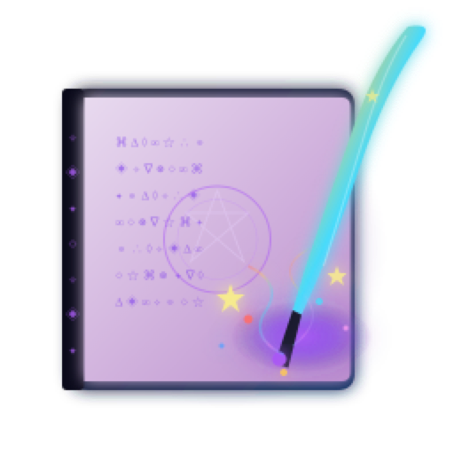
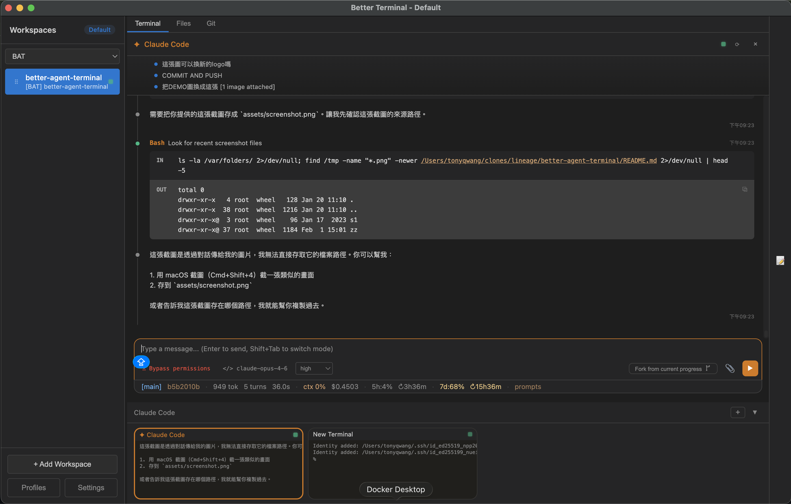
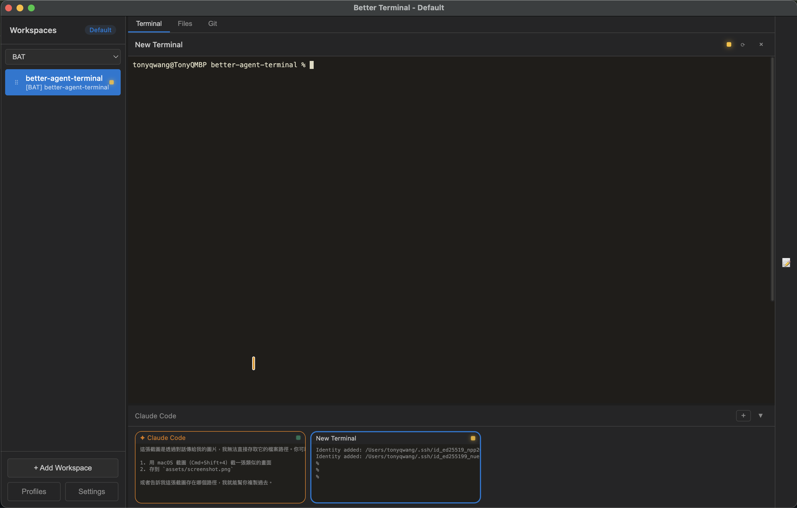

# Better Agent Terminal

<div align="center">




**跨平台終端機聚合器，支援多工作區管理與內建 AI Agent 整合**

在同一個視窗中管理多個專案終端機，內建支援 **Claude Code、Gemini CLI、GitHub Copilot CLI、Codex CLI** 及任意自訂 CLI 代理。附帶檔案瀏覽器、Git 檢視器、Snippet 管理器、遠端存取，以及可協調多個 AI Agent 的 **Supervisor 模式**。

[下載最新版本](https://github.com/gowerlin/better-agent-terminal/releases/latest)

</div>

---

## 擷圖

<div align="center">

**Claude Code Agent 面板** — 內建 AI Agent，支援權限控制、狀態列與串流輸出


**終端機** — 在 Agent 旁執行持久終端機，方便運行長時間指令與監控


</div>

---

## 功能特色

### 🖥️ 工作區管理
- 多工作區標籤頁，支援拖放排序與分組
- 每個工作區獨立的終端機實例、Agent 對話與環境變數
- 工作區封存與排序管理
- 跨重啟保存工作區狀態
- 可分離式視窗 — 將工作區拉出為獨立視窗

### 🤖 AI Agent 整合
- **Claude Code (SDK)** — 結構化事件、權限控制、對話續接
- **Claude Code (CLI)** — 完整 CLI 體驗
- **Gemini CLI** — Google AI 助手，支援沙箱模式
- **GitHub Copilot CLI** — GitHub AI 程式助手
- **Codex CLI** — OpenAI 程式代理，支援沙箱/YOLO 模式
- **自訂 CLI** — 從設定中新增任意 CLI 工具作為 Agent

### ⭐ 指令自動完成
- `*` 前綴觸發星號指令（掃描 `ct-*`、`gsd-*` 等 Skill）
- `/` 前綴觸發斜線指令（Claude Code 內建指令）
- Agent 面板與 PromptBox 均支援
- 鍵盤導航選取

### 🏗️ Control Tower 整合
- **看板檢視** — 視覺化管理工單狀態（待辦 / 進行中 / 已完成）
- **Sprint 進度** — 即時追蹤 Sprint 完成百分比
- **工單操作** — 一鍵執行 `ct-exec`、`ct-done`、`ct-sync`
- **CtToast 通知** — 工單狀態變更即時通知

### 👁 Supervisor 模式
- 指定一個終端機為 Supervisor，監控其他 Worker 終端機
- Worker 面板顯示各 Worker 的代理類型、狀態與最近輸出
- 快速發送指令給任意 Worker
- 適用場景：TDD 工作流、Code Review 管線、平行任務分派

### 📡 遠端存取
- 內建 WebSocket 伺服器，供其他 BAT 實例或行動裝置連線
- Remote Profile 連線（BAT 對 BAT）
- QR Code 掃描連線（行動裝置）
- 自動偵測 Tailscale IP，建議用於跨網路連線

### 📊 狀態列
- 13 項可配置狀態顯示（模型、成本、Token、快取等）
- 自訂顏色、區域對齊與範本設定
- API 用量輪詢：Chrome Session Key（主要）→ OAuth（備用）

### 🔧 其他功能
- 終端機縮圖列 — 快速切換多終端機
- 內建檔案瀏覽器與 Git 檢視器
- Snippet 管理器 — 儲存與快速插入常用指令
- 可點擊的檔案路徑與 URL 連結
- 環境變數編輯器（每工作區獨立）
- Git Worktree 隔離 — 在獨立 worktree 中運行 Agent
- 自動更新檢查
- 多語系支援（繁體中文 / 英文 / 日文 / 德文 / 法文 / 韓文 / 簡體中文）
- 深色主題 UI

---

## 快速開始

### 方式一：Homebrew (macOS)

```bash
brew install tonyq-org/tap/better-agent-terminal
```

### 方式二：Chocolatey (Windows)

```powershell
choco install better-agent-terminal
```

### 方式三：直接下載

從 [Releases](https://github.com/gowerlin/better-agent-terminal/releases/latest) 下載對應平台安裝包：

| 平台 | 檔案格式 |
|------|---------|
| Windows | `.exe` 安裝檔 或 `.zip` 免安裝版 |
| macOS | `.dmg` (Universal: Intel + Apple Silicon) |
| Linux | `.AppImage` |

> macOS 首次執行可能會被阻擋 — 前往 **系統設定 > 隱私與安全性**，下滑點選 **仍要打開**。

### 方式四：從原始碼建置

**前置需求：**
- [Node.js](https://nodejs.org/) 18+
- [Claude Code CLI](https://docs.anthropic.com/en/docs/claude-code) 已安裝並驗證

```bash
git clone https://github.com/gowerlin/better-agent-terminal.git
cd better-agent-terminal
npm install
```

**開發模式：**
```bash
npm run dev
```

**建置正式版：**
```bash
npm run build
```

### 方式五：快速安裝腳本

```bash
curl -fsSL https://raw.githubusercontent.com/gowerlin/better-agent-terminal/main/install.sh | bash
```

---

## 鍵盤快速鍵

| 快速鍵 | 功能 |
|--------|------|
| `Ctrl+T` | 新增終端機 |
| `Ctrl+W` | 關閉目前終端機 |
| `Ctrl+Tab` | 切換下一個終端機 |
| `Ctrl+Shift+Tab` | 切換上一個終端機 |
| `Ctrl+1~9` | 切換至指定終端機 |
| `Ctrl+K` | 清除終端機 |
| `Ctrl+Shift+V` | 貼上到終端機 |
| `Ctrl+N` | 新增工作區 |
| `Ctrl+Shift+N` | 開啟新視窗 |

---

## 架構

```
better-agent-terminal/
├── electron/                          # 主程序 (Node.js)
│   ├── main.ts                        # 應用程式入口、IPC 處理、視窗管理
│   ├── preload.ts                     # Context Bridge (window.electronAPI)
│   ├── pty-manager.ts                 # PTY 程序生命週期、輸出批次、環形緩衝
│   ├── claude-agent-manager.ts        # Claude SDK 工作階段管理
│   ├── worktree-manager.ts            # Git worktree 生命週期
│   ├── agent-runtime/                 # 通用 Agent 運行層
│   ├── logger.ts                      # 磁碟日誌（BAT_DEBUG=1 啟用）
│   ├── snippet-db.ts                  # SQLite Snippet 儲存
│   ├── profile-manager.ts             # 設定檔 CRUD
│   ├── update-checker.ts              # GitHub Release 更新檢查
│   └── remote/                        # 遠端存取模組
├── src/                               # 渲染程序 (React)
│   ├── App.tsx                        # 根元件、佈局
│   ├── components/                    # UI 元件
│   ├── stores/                        # 狀態管理
│   ├── types/                         # 型別定義
│   └── styles/                        # 樣式表
└── package.json
```

### 技術堆疊

| 類別 | 技術 |
|------|------|
| 前端 | React 18 + TypeScript |
| 終端機 | xterm.js + node-pty |
| 框架 | Electron 28 |
| AI | @anthropic-ai/claude-agent-sdk |
| 建置 | Vite 5 + electron-builder |
| 儲存 | better-sqlite3 |
| 遠端 | ws (WebSocket) + qrcode |
| 語法標示 | highlight.js |

---

## 發行

### 版本格式

遵循語意化版號：`vMAJOR.MINOR.PATCH`（例如 `v2.1.3`）

預覽版使用 `-pre.N` 後綴（例如 `v2.1.4-pre.1`）。含 `-pre` 的 tag 自動標記為 GitHub Pre-release。

### 自動發行 (GitHub Actions)

推送 tag 以觸發所有平台建置：

```bash
git tag v2.1.4
git push origin v2.1.4
```

或透過 VSCode Task「CI/CD: 觸發 Pre-Release」手動觸發 `workflow_dispatch`。

---

## 設定

工作區、設定與工作階段資料儲存位置：

| 平台 | 路徑 |
|------|------|
| Windows | `%APPDATA%/better-agent-terminal/` |
| macOS | `~/Library/Application Support/better-agent-terminal/` |
| Linux | `~/.config/better-agent-terminal/` |

### 除錯日誌

設定環境變數 `BAT_DEBUG=1` 啟用磁碟日誌。日誌寫入設定目錄下的 `debug.log`。

---

## 授權

MIT License — 詳見 [LICENSE](LICENSE)。

---

## 致謝

本專案 fork 自以下優秀的開源專案：

- **原始專案** — [tony1223/better-agent-terminal](https://github.com/tony1223/better-agent-terminal) by **TonyQ** ([@tony1223](https://github.com/tony1223))
- **中間 fork** — [scandnavik/better-agent-terminal](https://github.com/scandnavik/better-agent-terminal)

### 原始貢獻者

- **lmanchu** ([@lmanchu](https://github.com/lmanchu)) — macOS/Linux 支援、工作區角色
- **bluewings1211** ([@bluewings1211](https://github.com/bluewings1211)) — Shift+Enter 換行、保留工作區狀態、可調整面板
- **Henry Hu** ([@ninedter](https://github.com/ninedter)) — Key API 發現與架構回饋
- **craze429** ([@craze429](https://github.com/craze429)) — Windows/Linux 憑證讀取、權限修正、Git 解析修正
- **Owen** ([@Owen0857](https://github.com/Owen0857)) — Windows 殭屍程序修正、終端機重設大小黑屏修正
- **MikeThai** ([@mikethai](https://github.com/mikethai)) — macOS .dmg spawn ENOENT 修正
- **Luke Chang** ([@lukeme117](https://github.com/lukeme117)) — Snippet 側邊欄與 UI 改進

---

<div align="center">

Built with Claude Code

</div>
