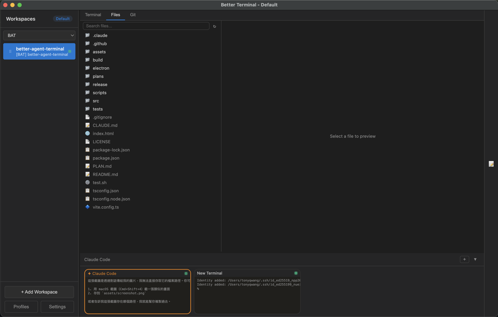
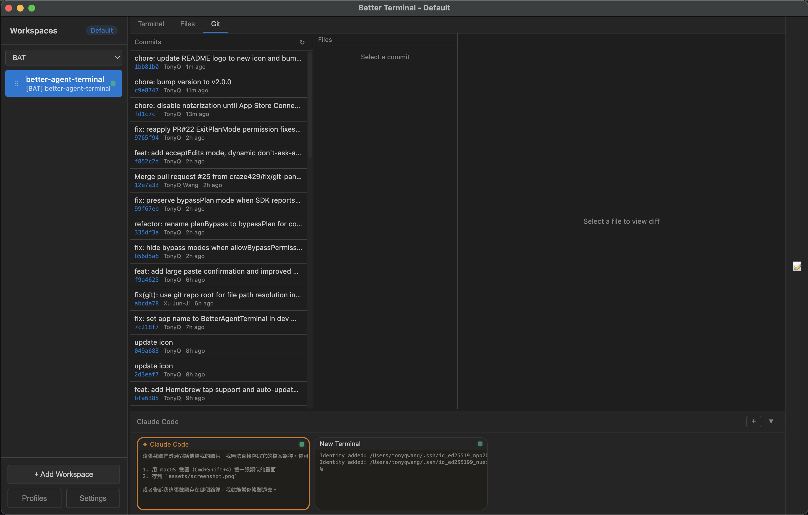

# Better Agent Terminal

<div align="center">


**A cross-platform terminal aggregator with multi-workspace support and built-in AI agent integration**

Manage multiple project terminals in one window, with built-in support for **Claude Code, Gemini CLI, GitHub Copilot CLI, Codex CLI**, and any custom CLI agent — all in a single Electron app. Includes a file browser, git viewer, snippet manager, remote access, and a **supervisor mode** for orchestrating multiple AI agents on the same project.

[Download Latest Release](https://github.com/tony1223/better-agent-terminal/releases/latest)

</div>

---

## Screenshots

<div align="center">

**Claude Code Agent Panel** — Built-in AI agent with permission controls, status line, and streaming output


**Terminal** — Run persistent terminals alongside your agent for long-running commands and monitoring


**File Browser** — Browse and preview project files without leaving the app


**Git Viewer** — View commit history and diffs at a glance


</div>

---

## Features

### Workspace Management
- **Multi-Workspace** — Organize terminals by project folders; each workspace binds to a directory
- **Drag & Drop** — Reorder workspaces freely in the sidebar
- **Groups** — Categorize workspaces into named groups with a filter dropdown
- **Profiles** — Save and switch between multiple workspace configurations (local or remote)
- **Detachable Windows** — Pop out individual workspaces to separate windows; auto-reattach on restart
- **Per-Workspace Env Vars** — Configure custom environment variables per workspace
- **Activity Indicators** — Visual dots showing which workspaces have active terminal processes
- **Double-click to rename**, right-click context menu for all workspace actions

### Terminal
- **Split-panel layout** — 70% main panel + 30% scrollable thumbnail bar showing all terminals
- **Multiple terminals per workspace** — Powered by xterm.js with full Unicode/CJK support
- **Agent presets** — Pre-configured terminal roles: Claude Code, Gemini CLI, Codex, GitHub Copilot, or plain terminal
- **Custom CLI agents** — Register any CLI tool as an agent from Settings (name, command, icon, color, sandbox/yolo mode)
- **Supervisor mode** — Designate one terminal as the project supervisor to monitor and send commands to other worker terminals (right-click → Set as Supervisor)
- **Git worktree isolation** — Spawn Claude agents in an isolated worktree to prevent destructive changes to your main working tree
- **Tab navigation** — Switch between Terminal, Files, and Git views per workspace
- **File browser** — Search, navigate, and preview files with syntax highlighting (highlight.js)
- **Git integration** — Commit log, diff viewer, branch display, untracked file list, GitHub link detection
- **Snippet manager** — Save, organize, search, and paste code snippets (SQLite-backed with categories and favorites)

### Claude Code Agent
- **Built-in Claude Code** via SDK — Runs the agent directly inside the app; no separate terminal needed
- **Message streaming** with extended thinking blocks (collapsible)
- **Permission-based tool execution** — Every tool call is intercepted; approve individually, or enable bypass/plan mode for auto-approval
- **Subagent tracking** — See spawned subagent tasks with progress indicators and stall detection
- **Session resume** — Persist conversations and resume them across app restarts
- **Session fork** — Branch off from any point in a conversation
- **Rest/Wake sessions** — Pause and resume agent sessions from the context menu to save resources
- **Statusline** — Live display of token usage, cost, context window %, model name, git branch, turn count, and session duration
- **Usage monitoring** — Track API rate limits (5-hour and 7-day windows) via Anthropic OAuth
- **Context usage panel** — Visualize token usage breakdown by category (code, conversation, tools, memory, etc.)
- **Account switching** — `/login`, `/logout`, `/whoami` slash commands for managing Claude accounts
- **Prompt history** — View and copy all previous user prompts from the statusline
- **Image attachment** — Drag-drop or use the attach button (up to 5 images per message)
- **Clickable URLs** — Markdown links and bare URLs open in the default browser
- **Clickable file paths** — Click any file path in agent output to preview it with syntax highlighting and search (Ctrl+F)
- **Ctrl+P file picker** — Fuzzy-search project files and attach them to the conversation context
- **Update notifications** — Automatic check for new releases on GitHub

---

## Keyboard Shortcuts

| Shortcut | Action |
|---|---|
| `Ctrl+`` ` `` / `Cmd+`` ` `` | Toggle between Agent terminal and first regular terminal |
| `Ctrl+←/→` / `Cmd+←/→` | Cycle workspace tabs (Terminal / Files / Git) |
| `Ctrl+↑/↓` / `Cmd+↑/↓` | Switch to previous / next workspace |
| `Ctrl+P` / `Cmd+P` | File picker (search & attach files to agent context) |
| `Ctrl+N` / `Cmd+N` | Open new window |
| `Shift+Tab` | Switch between Terminal and Agent mode |
| `Enter` | Send message |
| `Shift+Enter` | Insert newline (multiline input) |
| `Escape` | Stop streaming / close modal |
| `Ctrl+Shift+C` | Copy selected text |
| `Ctrl+Shift+V` | Paste from clipboard |
| `Right-click` | Copy (if text selected) or Paste |

## Slash Commands

| Command | Description |
|---|---|
| `/resume` | Resume a previous Claude session from history |
| `/model` | Switch between available Claude models |
| `/new` / `/clear` | Reset session (clear conversation, fresh start) |
| `/snippet` | Show snippets to Claude for management |
| `/login` | Sign in to Claude (switch account) |
| `/logout` | Sign out of Claude |
| `/whoami` | Show current account info and usage |

---

## Quick Start

### Option 1: Homebrew (macOS)

```bash
brew tap tonyq-org/tap
brew install --cask better-agent-terminal
```

### Option 2: Chocolatey (Windows) *(coming soon)*

```powershell
choco install better-agent-terminal
```

> Package is currently pending review on Chocolatey.org.

### Option 3: Download Release

Download from [Releases](https://github.com/tony1223/better-agent-terminal/releases/latest) for your platform:

| Platform | Format |
|---|---|
| Windows | NSIS installer, `.zip` |
| macOS | `.dmg` (universal binary) |
| Linux | `.AppImage` |

**macOS DMG installation:**

1. Download the `.dmg` file from Releases
2. Double-click the `.dmg` to mount it
3. Drag **Better Agent Terminal** into the **Applications** folder
4. On first launch, macOS may block the app — go to **System Settings > Privacy & Security**, scroll down and click **Open Anyway**
5. Make sure [Claude Code CLI](https://docs.anthropic.com/en/docs/claude-code) is installed (`npm install -g @anthropic-ai/claude-code`)

### Option 4: Build from Source

**Prerequisites:**
- [Node.js](https://nodejs.org/) 18+
- [Claude Code CLI](https://docs.anthropic.com/en/docs/claude-code) installed and authenticated

```bash
git clone https://github.com/tony1223/better-agent-terminal.git
cd better-agent-terminal
npm install
```

**Development mode:**
```bash
npm run dev
```

**Build for production:**
```bash
npm run build
```

### Option 5: Quick Install (Script)

Run the following command in your terminal (macOS, Linux, or Windows with Git Bash/MSYS2):

```bash
curl -fsSL https://raw.githubusercontent.com/tony1223/better-agent-terminal/main/install.sh | bash
```

This script will detect your OS and install the application to the standard location.

### macOS Build Notes

Native dependencies (`node-pty`, `better-sqlite3`) require Xcode Command Line Tools:

```bash
xcode-select --install
```

Then:

```bash
npm install
npm run dev      # Development
npm run build    # Build .dmg
```

---

## Architecture

```
better-agent-terminal/
├── electron/                          # Main process (Node.js)
│   ├── main.ts                        # App entry, IPC handlers, window management
│   ├── preload.ts                     # Context bridge (window.electronAPI)
│   ├── pty-manager.ts                 # PTY process lifecycle, output batching, ring buffer
│   ├── claude-agent-manager.ts        # Claude SDK session management
│   ├── worktree-manager.ts            # Git worktree lifecycle (create, remove, rehydrate)
│   ├── agent-runtime/                 # Universal agent runtime layer
│   │   ├── types.ts                   # AgentDefinition, AgentProvider, AgentCapabilities
│   │   ├── agent-registry.ts          # Singleton registry with 9 built-in + custom CLI definitions
│   │   └── index.ts                   # Module barrel export
│   ├── logger.ts                      # Disk-based logger (enable with BAT_DEBUG=1)
│   ├── snippet-db.ts                  # SQLite snippet storage
│   ├── profile-manager.ts            # Profile CRUD and persistence
│   ├── update-checker.ts             # GitHub release update check
│   └── remote/
│       ├── protocol.ts                # Proxied channel/event definitions
│       ├── handler-registry.ts        # Unified IPC + remote handler registry
│       ├── broadcast-hub.ts           # Event broadcasting to remote clients
│       ├── remote-server.ts           # WebSocket server (host mode)
│       ├── remote-client.ts           # WebSocket client (connect mode)
│       └── tunnel-manager.ts          # IP detection, Tailscale, QR code info
├── src/                               # Renderer process (React)
│   ├── App.tsx                        # Root component, layout, profile orchestration
│   ├── components/
│   │   ├── Sidebar.tsx                # Workspace list, groups, drag-drop, context menu
│   │   ├── WorkspaceView.tsx          # Per-workspace container with supervisor wiring
│   │   ├── WorkerPanel.tsx            # Supervisor worker list with send-to-worker UI
│   │   ├── ClaudeAgentPanel.tsx       # Claude agent chat UI and streaming
│   │   ├── TerminalPanel.tsx          # xterm.js terminal wrapper (optimized rendering)
│   │   ├── ThumbnailBar.tsx           # Scrollable terminal thumbnail strip
│   │   ├── MainPanel.tsx              # Tab container (Terminal / Files / Git)
│   │   ├── TerminalThumbnail.tsx      # Terminal thumbnail with supervisor badge + context menu
│   │   ├── GitPanel.tsx               # Git log, diff, status viewer
│   │   ├── FileTree.tsx               # In-app file browser
│   │   ├── PathLinker.tsx             # Clickable file paths & URLs, preview modal
│   │   ├── SnippetPanel.tsx           # Snippet manager sidebar
│   │   ├── PromptBox.tsx              # Agent message input with image attach
│   │   ├── SettingsPanel.tsx          # App settings UI + Custom CLI management
│   │   ├── ProfilePanel.tsx           # Profile switcher
│   │   ├── EnvVarEditor.tsx           # Per-workspace env var editor
│   │   └── UpdateNotification.tsx     # Update banner
│   ├── stores/
│   │   ├── workspace-store.ts         # Workspace + terminal state + supervisor methods
│   │   └── settings-store.ts          # App settings persistence
│   ├── types/
│   │   ├── index.ts                   # Core types (Workspace, TerminalInstance w/ role, etc.)
│   │   ├── agent-runtime.ts           # Frontend-side agent types + helpers
│   │   ├── claude-agent.ts            # Claude message and tool call types
│   │   ├── agent-presets.ts           # Agent preset definitions
│   │   └── electron.d.ts             # window.electronAPI type declarations
│   └── styles/
│       ├── main.css
│       ├── claude-agent.css
│       └── path-linker.css
├── assets/                            # App icons and screenshots
├── scripts/
│   └── build-version.js               # Version string generator
└── package.json
```

### Tech Stack
- **Frontend:** React 18 + TypeScript
- **Terminal:** xterm.js + node-pty
- **Framework:** Electron 28
- **AI:** @anthropic-ai/claude-agent-sdk
- **Build:** Vite 5 + electron-builder
- **Storage:** better-sqlite3 (snippets, session data)
- **Remote:** ws (WebSocket) + qrcode
- **Syntax Highlighting:** highlight.js

---

## Multi-Agent Architecture

BAT supports running multiple AI CLI agents simultaneously within the same workspace. Instead of being locked to a single agent, you can mix and match different AI tools for different tasks.

### Built-in Agents

| Agent | Command | Capabilities |
|---|---|---|
| Claude Code (SDK) | Built-in SDK integration | Structured events, permission controls, session resume |
| Claude Code (CLI) | `claude` | Full CLI experience in terminal |
| Gemini CLI | `gemini` | Google's AI assistant, sandbox mode |
| GitHub Copilot CLI | `github-copilot-cli` | GitHub's AI coding assistant |
| Codex CLI | `codex` | OpenAI's coding agent, sandbox/yolo modes |

### Custom CLI Agents

Add any CLI tool as an agent from **Settings → Custom CLIs**:

1. Open Settings (gear icon in sidebar)
2. Scroll to **Custom CLI Management**
3. Fill in: Name, Command, Icon (emoji), Color (hex), and optional Sandbox/Yolo flags
4. Click **Add** — the new agent appears in the "+" menu immediately

Custom CLIs are persisted to `{userData}/custom-clis.json` and survive app restarts.

### Agent Registry API

The agent runtime layer exposes IPC methods for querying and managing agents:

| IPC Channel | Description |
|---|---|
| `agent:list-definitions` | List all registered agent definitions |
| `agent:get-definition` | Get a specific agent definition by ID |
| `agent:build-launch-command` | Build the CLI launch command with flags |
| `agent:register-custom-cli` | Register a new custom CLI agent |
| `agent:remove-custom-cli` | Remove a custom CLI agent |

---

## Supervisor Mode

Supervisor mode lets you designate one terminal as a **project supervisor** that can monitor and send commands to other **worker** terminals. This enables orchestration patterns where one AI agent oversees the work of others.

### How It Works

1. Open multiple terminals with different agents (e.g., Claude as supervisor, Codex + Gemini as workers)
2. Right-click any terminal thumbnail → **"👁 Set as Supervisor"**
3. The supervisor terminal gets a golden border and 👁 badge
4. A **Worker Panel** appears on the right side showing all other terminals with:
   - Worker name, agent type, and alive/dead status
   - Last few lines of each worker's output
   - Quick-send input field to type commands into any worker
5. Only one supervisor per workspace; setting a new one auto-demotes the previous

### Supervisor IPC

| IPC Channel | Description |
|---|---|
| `supervisor:list-workers` | List worker terminals with status and last output |
| `supervisor:send-to-worker` | Write text to a worker terminal's PTY input |
| `supervisor:get-worker-output` | Read last N lines from a worker's output buffer |

### Use Cases

- **Test-driven development**: Claude monitors test results, tells Codex to fix failing tests
- **Code review pipeline**: Supervisor reviews changes, dispatches fixes to workers
- **Parallel task execution**: Assign different features to different agents, monitor progress from one place

---

BAT includes a built-in WebSocket server that allows other BAT instances or mobile devices to connect and control it remotely. This feature is currently **experimental**.

### How It Works

1. The **Host** enables the WebSocket server in Settings → Remote Access (default port: 9876)
2. On startup, the server generates a **Connection Token** (32-character hex string) used to authenticate connections
3. The **Client** connects by entering the host IP, port, and token via a Remote Profile
4. Once connected, the client can operate all terminals, Claude Agent sessions, workspaces, and other features on the host

### Connection Methods

#### Method 1: Remote Profile (BAT-to-BAT)

On the client BAT instance:

1. Open Settings → Profiles
2. Create a new profile and set the type to **Remote**
3. Enter the host IP, port (9876), and token
4. Load the profile to connect to the remote host

#### Method 2: QR Code (Mobile Devices)

On the host BAT instance:

1. Open Settings → Remote Access → **Generate QR Code**
2. If the server is not yet running, it will start automatically
3. Scan the QR code with a mobile device to retrieve the connection info
4. The QR code contains the WebSocket URL and token (in JSON format)

### Recommended: Use Tailscale for Cross-Network Connections

If the host and client are not on the same local network (e.g., connecting from home to an office machine), we recommend using [Tailscale](https://tailscale.com/) to establish a secure peer-to-peer VPN:

- **Free plan** supports up to 100 devices
- No port forwarding or additional server setup required
- Each device gets a stable `100.x.x.x` IP address
- BAT automatically detects Tailscale IPs and uses them preferentially

**Installation:**

| Platform | Install |
|----------|---------|
| macOS | [Download](https://tailscale.com/download/macos) or `brew install tailscale` |
| Windows | [Download](https://tailscale.com/download/windows) |
| iOS | [App Store](https://apps.apple.com/app/tailscale/id1470499037) |
| Android | [Google Play](https://play.google.com/store/apps/details?id=com.tailscale.ipn) |
| Linux | [Install Guide](https://tailscale.com/download/linux) |

After installation, sign in with the same account on all devices and they will be able to communicate. BAT's QR code will automatically use the Tailscale IP.

### Security Notice

> **Warning:** Enabling the Remote Server opens a WebSocket connection. Any device with the token can fully control BAT on the host machine, including executing terminal commands, accessing the file system, and controlling Claude Agent sessions.
>
> - Do not start the server on untrusted networks
> - Do not share the token with untrusted parties
> - Shut down the server when not in use
> - Strongly recommended to use Tailscale to avoid direct exposure to the public internet

---

## Configuration

Workspaces, settings, and session data are saved to:

| Platform | Path |
|---|---|
| Windows | `%APPDATA%/better-agent-terminal/` |
| macOS | `~/Library/Application Support/better-agent-terminal/` |
| Linux | `~/.config/better-agent-terminal/` |

### Debug Logging

Set the `BAT_DEBUG=1` environment variable to enable disk-based debug logging. Logs are written to `debug.log` in the configuration directory.

---

## Release

### Version Format

Follows semantic versioning: `vMAJOR.MINOR.PATCH` (e.g., `v2.1.21`)

Pre-release versions use the `-pre.N` suffix (e.g., `v2.1.21-pre.1`). Tags containing `-pre` are automatically marked as pre-release on GitHub and do not update the Homebrew tap.

### Automated Release (GitHub Actions)

Push a tag to trigger builds for all platforms:

```bash
git tag v2.1.21
git push origin v2.1.21
```

---

## License

MIT License - see [LICENSE](LICENSE) for details.

---

## Author

**TonyQ** - [@tony1223](https://github.com/tony1223)

## Contributors

- **lmanchu** - [@lmanchu](https://github.com/lmanchu) - macOS/Linux support, workspace roles
- **bluewings1211** - [@bluewings1211](https://github.com/bluewings1211) - Shift+Enter newline, preserve workspace state, resizable panels
- **Henry Hu** - [@ninedter](https://github.com/ninedter) - Key API discovery and valuable architectural feedback
- **craze429** - [@craze429](https://github.com/craze429) - Windows/Linux credential reading, permission fix, git parsing fix, async dialog
- **Owen** - [@Owen0857](https://github.com/Owen0857) - Windows zombie process fix, terminal resize black screen fix, debug log cleanup
- **MikeThai** - [@mikethai](https://github.com/mikethai) - macOS .dmg spawn ENOENT fix
- **Luke Chang** - [@lukeme117](https://github.com/lukeme117) - Snippet sidebar and UI improvements

---

## Star History

<a href="https://www.star-history.com/?repos=tony1223%2Fbetter-agent-terminal&type=date&legend=top-left">
 <picture>
   <source media="(prefers-color-scheme: dark)" srcset="https://api.star-history.com/image?repos=tony1223/better-agent-terminal&type=date&theme=dark&legend=top-left" />
   <source media="(prefers-color-scheme: light)" srcset="https://api.star-history.com/image?repos=tony1223/better-agent-terminal&type=date&legend=top-left" />
   
 </picture>
</a>

---

<div align="center">

Built with Claude Code

</div>
