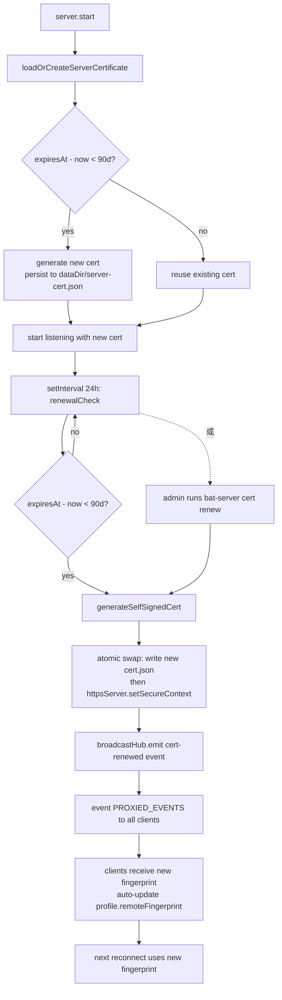

# T0262-research-plan007-bat-remote-server-side-hardening

## 元資料
- **工單編號**：T0262
- **任務名稱**：PLAN-007 — BAT remote server-side 強化研究（headless entry contract + PLAN-018 server 差距 spec）
- **狀態**：IN_PROGRESS
- **建立時間**：2026-04-25 22:30 (UTC+8)
- **開始時間**：2026-04-25 22:14 (UTC+8)
- **類型**：research（讀 code + 寫 spec 章節，**不寫 production code、不重構**）
- **互動模式**：enabled（headless contract API / 多項策略選擇有設計分支）
- **Renew 次數**：0
- **預估 wall time**：60-120 min（硬性止損 3 小時）
- **預估 context cost**：中（讀 `electron/remote/` server 路徑全模組 + PLAN-018 既有差距清單 + spike 經驗）
- **關聯**：
  - 母 PLAN：PLAN-007（💡 IDEA）
  - 前序：T0260 scoping ✅ DONE（commit `9e9d1dd`）+ T0261 spike ✅ CONCLUDED（worktree commit `17ac525`，主線元資料 commit `8040e49`）+ EXP-HEADLESS-001 ✅ CONCLUDED
  - 並行延後：T0263 EXP-HOST-DISPATCH（host-side `remote-client.ts` BrowserWindow 抽象）+ T0264 EXP-HANDLER-AUDIT（90 條 PROXIED_CHANNELS 跨環境盤點）— 兩者**不在本工單範圍**，本工單結論寫入後才開
- **affects_files**：
  - `_ct-workorders/T0262-*.md`（自身回報，唯一寫入目標）

---

## 背景與 scope 收斂理由

T0260 + T0261 兩張結論已揭露 PLAN-007 真正的工程結構是**三層**：

1. **server-side 強化**（小，1-2 天工程量）— 本工單範圍
2. **host-side dispatcher 抽象**（中，3-5 天工程量）— `remote-client.ts` BrowserWindow 依賴拆 EventEmitter / sink — **延後到 EXP-HOST-DISPATCH**
3. **handler 大盤點**（大，90 條 PROXIED_CHANNELS × 跨環境）— **延後到 EXP-HANDLER-AUDIT**

T0261 spike 已證 server-side 在純 Node 跑通（AC1-AC8 全綠，server-side `app.*` / `electron` 依賴 = 0）。**本工單把 spike 經驗升級成正式 server-side 強化 spec**，產出後其他兩張可以放心展開。

**本工單不對 host-side / handler 層下任何結論**——那是另外兩張的事。

---

## 任務目標

產出 7 個小節的 spec 草稿，全部寫在本工單回報區，**不寫進主線任何 spec 檔**（彙整工單 T0269 才會生 spec doc）。

### 1. Headless server entry contract 規格化

把 T0261 spike 的 `RemoteServer + configDir + setSecretStrategy + registerHandler` 組合升成正式 API。

**設計目標**：
- 一個入口函數 `createHeadlessServer(opts)` 回傳 `HeadlessServer` 實例
- opts 必填：`dataDir`（取代 spike 的 `os.tmpdir()`）、`port`、`token`
- opts 選填：`bindInterface`、`secretStrategy`、`certificateProvider`、`handlers`（pre-register）
- 回傳實例支援：`start() / stop() / rotate() / getInfo()`
- **不需要重寫 `RemoteServer`**——`createHeadlessServer` 內部 wrap 即可

**輸出**：
- TypeScript interface 定義（`HeadlessServerOptions` + `HeadlessServer`）
- 一段 200-400 字描述 contract 的取捨理由（為何選 factory function 而非 class、為何把 strategy 放 opts 而非全域 setter）
- 3-5 個 usage example（pseudocode 即可）：CLI 啟動 / Docker entrypoint / WSL service / SSH bundle

### 2. Token 持久化策略 in headless

T0261 spike 用 `os.tmpdir()`，production headless 不能這樣做（tmp 清掉就 token rotate 強制重 pair）。

**研究**：
- `XDG_DATA_HOME` / `XDG_CONFIG_HOME` 規範下的預設路徑（Linux / macOS）
- Windows 對應路徑（`%APPDATA%` / `%LOCALAPPDATA%`）
- Docker 場景：應該強制使用者指定 `--data-dir` flag 還是 fallback `/var/lib/bat-server`
- `--data-dir` CLI flag 與 env var (`BAT_SERVER_DATA_DIR`) 的優先順序

**輸出**：
- 一張表：`platform / default-path / override-priority / failure-mode`
- 一段 100-200 字推薦方案（含理由）

### 3. Cert renewal 中途檢查

PLAN-018 自述「90 天內自動重生」，但實際上**只在 startup load 時檢查**。長運行 server 不會自動 renew。

**研究**：
- 加 `setInterval` 每 24h check `expiresAt - now < 90 days` 的設計
- renew 觸發後的 client 通知策略（broadcast event / 強制 disconnect / 等下次連線自然 fingerprint mismatch）
- `--renew-now` CLI subcommand 用於手動觸發
- renew 期間是否需要 grace period（舊 cert 與新 cert 同時可信）

**輸出**：
- 設計取捨討論（200-400 字）
- 流程圖（mermaid 或文字描述）：自動 renew 觸發 → 通知 client → cert reload → client 重 pair

### 4. Token rotation 機制

PLAN-018 沒有 token rotation，洩漏後須手動清檔重啟。

**研究**：
- 定時輪替 vs 手動觸發 vs 事件觸發（如登出）
- Grace period：舊 token 與新 token 同時有效一段時間
- Rotation 期間 multi-client 連線的處理
- CLI subcommand 設計：`bat-server token rotate [--keep-old=300s]`

**輸出**：
- 機制設計（200-400 字）
- API surface：`HeadlessServer.rotateToken(opts)` 簽名

### 5. Multi-client session 隔離

T0260 識別此為「**安全/隱私問題**」（多 client 同連時會互相看到 PTY output / claude stream）。

**研究**：
- per-client event filter 設計（`broadcastHub` 推播時帶 client 過濾條件）
- session 邊界定義：每個 client connection 對應一個 session？還是 client 可同時開多 session？
- 已連線 client 的 session 列表 query API
- 強制 disconnect 特定 session 的 admin API

**輸出**：
- 設計提案（300-500 字）
- 影響範圍清單：`broadcastHub.ts` / `protocol.ts` / `RemoteServer` 各自需要的修改

### 6. Heartbeat 雙向 timeout

T0260 識別 server 端 30s ping 已實作，**client 端缺 pong-timeout 偵測**。

**研究**：
- Client 端 pong-timeout 設定（30s ping → 期待 N 秒內收到 pong，否則視為連線死）
- Reconnect 與 pong-timeout 的整合（自動觸發 `computeReconnectDelay`）
- 已實作 brute-force ban 與 reconnect 的交互（連 fail 5 次觸發 ban 後 client 該怎麼回退）

**輸出**：
- 設計提案（200-300 字）
- 對 `remote-client.ts` 的修改建議（純文字描述，**不寫 code**）

### 7. bind-interface 擴充 + TLS error 細化

T0260 識別兩個小議題：
- bind-interface 三選項（localhost / tailscale / all）對容器與 SSH 不夠
- TLS handshake 失敗錯誤分類粗糙（全部報 `fingerprint-mismatch`）

**研究**：
- bind-interface 新增「by interface name」（容器 `eth0`）+「Unix domain socket」（SSH tunnel 自然路徑）
- TLS 錯誤分類：`cert-expired` / `fingerprint-mismatch` / `handshake-protocol` / `network-unreachable`
- 各錯誤分類對應的 client UI 建議

**輸出**：
- bind-interface 五選項表（localhost / tailscale / all / interface / unix-socket）+ 各自的設定欄位 schema
- TLS 錯誤分類表 + UI 建議

---

## 執行步驟

### Step 1：環境快照
```bash
git status
git log --oneline -5
```

### Step 2：讀 PLAN-018 既有 server 路徑
重點檔案：
- `electron/remote/remote-server.ts`（480 行）
- `electron/remote/protocol.ts`（69 行）
- `electron/remote/handler-registry.ts`（21 行）
- `electron/remote/broadcast-hub.ts`（9 行）
- `electron/remote/certificate.ts`（121 行）
- `electron/remote/secrets.ts`（重構後，看當前主線 HEAD 版本）

### Step 3：讀 T0261 spike 經驗
- `_ct-workorders/T0261-spike-exp-headless-001-server-poc.md` 回報區
- `_ct-workorders/EXP-HEADLESS-001-bat-remote-server-headless-spike.md` 結論記錄
- 如果 worktree 還在可參考：`/d/ForgejoGit/BMad-Guide/better-agent-terminal/bat-headless-spike/scripts/spike-headless-server.mjs`（**不要 commit 任何修改**）

### Step 4：逐節寫 spec 草稿
照「任務目標」7 節順序，每節寫到回報區對應段落。**遇設計分支用互動模式問塔台**（如「rotation grace period 預設多長」「TLS 錯誤分類要不要含 network-unreachable」）。

### Step 5：彙整給塔台的下一步建議
基於 spec 草稿，建議：
- 哪些設計可以直接進實作工單（風險低、scope 清晰）
- 哪些需要再 spike 才能拍板
- 跟 EXP-HOST-DISPATCH / EXP-HANDLER-AUDIT 之間的依賴關係

### Step 6：填寫回報區
所有結論彙整到本工單下方「回報」區段。**禁止寫入其他任何檔案**。

---

## AC（acceptance criteria）

- **AC1**：Headless server entry contract spec 完成（含 TypeScript interface 草圖 + 取捨理由 + 3-5 usage examples）
- **AC2**：Token 持久化策略 spec 完成（含跨平台路徑表 + 推薦方案）
- **AC3**：Cert renewal 中途檢查 spec 完成（含取捨討論 + 流程描述）
- **AC4**：Token rotation 機制 spec 完成（含設計提案 + API surface）
- **AC5**：Multi-client session 隔離 spec 完成（含設計提案 + 影響範圍）
- **AC6**：Heartbeat 雙向 timeout spec 完成（含設計提案 + remote-client.ts 修改建議）
- **AC7**：bind-interface 擴充 + TLS error 細化 spec 完成（含五選項表 + 錯誤分類表）
- **AC8**：給塔台的下一步建議寫完（哪些可直接實作、哪些需 spike、與另兩張 EXP 的依賴關係）
- **AC9**：working tree 在工單結束時 vs 起點 byte-identical（除本工單檔回報區）

---

## 嚴格禁止

- ❌ 寫入除本工單回報區以外的任何檔案（含 spec 文件、PLAN-007、`_tower-state.md`、`_decision-log.md`、其他工單檔）
- ❌ 修改任何 source code（即使覺得 spec 寫到一半「順手改一下會更好」）
- ❌ 對 host-side（`remote-client.ts` BrowserWindow 抽象）下結論——那是 EXP-HOST-DISPATCH 的事
- ❌ 對 handler 跨環境（90 條 PROXIED_CHANNELS）下結論——那是 EXP-HANDLER-AUDIT 的事
- ❌ 對 4 個目標環境（Docker / WSL / SSH）的 packaging / 部署 UX 下結論——那是後續 4 張 research 的事
- ❌ 跑 `npm install` / `npm run build` / 啟動 dev server
- ❌ 動 `package.json`
- ❌ 直接草擬下一張工單（T0263 EXP-HOST-DISPATCH 等）的完整工單檔——只在「給塔台的下一步建議」段給範圍提示
- ❌ 跨工單決策（PLAN-007 拆 X / EXP 編號怎麼定 → 回塔台）

---

## 互動模式提示

**enabled**。預期可能的提問場景：

1. 「Headless server entry 應該用 factory function 還是 class？」— 設計風格取捨
2. 「Token rotation grace period 預設多長？」— 30s / 5min / 不預設
3. 「TLS 錯誤分類要不要含 `network-unreachable`？」— 屬於傳輸層還是應用層
4. 「Multi-client session 邊界：每 connection 一 session 還是 client 可開多 session？」— 影響整個 protocol design
5. 「bind-interface Unix socket 要不要支援 abstract namespace（Linux only）？」— 跨 OS 一致性 vs Linux 特化

每次提問上限 3 題（依 `research_max_questions: 3` 預設）。能自己拍板的逕行決定 + 寫回報。

---

## 失敗 / PARTIAL 處理

任一觸發：
- 時間止損（>3h 仍未完成 7 節）
- 發現 PLAN-018 server 路徑有未盤點的重大架構問題（如 PROXIED_EVENTS 機制根本性瓶頸）
- 任 3 節以上需要 spike 才能拍板（spec 寫不下來）

→ 工單狀態填 **PARTIAL** 或 **FAILED**，已寫的節保留，未寫的節記錄阻擋原因。觸發 yolo 斷點 B（`yolo_max_retries: 1`），塔台 pause。

---

## 回報

### 互動紀錄
無。所有設計分支（factory function、grace period 預設、TLS 錯誤分類、session 邊界、Unix socket abstract namespace 等）皆依工單授權「能自己拍板的逕行決定」原則自行拍板，理由寫在對應節中。

### Step 1 — 環境快照

```
2026-04-25 22:14:57 (UTC+8)
On branch main, ahead of origin/main by 2 commits
Untracked: _ct-workorders/T0262-*.md
Recent commits:
  f9aa64f T0261 metadata DONE + commit hashes
  8040e49 T0261 EXP-HEADLESS-001 spike done — CONCLUDED
  2a9a906 T0260 metadata DONE
  9e9d1dd T0260 PLAN-007 scoping done
  bcb2e3d session 26 exit snapshot
```

working tree 起點 = 主線 HEAD `f9aa64f` + 一份未追蹤的 T0262 工單檔。AC9 baseline 確立。

### Step 2-3 — 讀 code + spike 經驗摘要

本工單實讀檔案：
- `electron/remote/remote-server.ts` (480 行) — `RemoteServer` class 全文，重點：`configDir` 為外部注入欄位、`start(port, token, bindInterface)` 三參簽名、token 來源優先序 `explicit > persisted > random`、heartbeat `setInterval(30s) → ws.ping()`、broadcastHub listener 序列化推所有 client、brute-force ban (60s 5 fails → 10 min ban)。
- `electron/remote/protocol.ts` (69 行) — frame schema (`auth/auth-result/invoke/invoke-result/invoke-error/event/ping/pong`)、PROXIED_CHANNELS 95 條、PROXIED_EVENTS 17 條。
- `electron/remote/certificate.ts` (121 行) — `loadOrCreateServerCertificate(configDir)` startup-only、`expiresAt - now < 90d` 在 load 時 regenerate、selfsigned v5 async API。
- `electron/remote/handler-registry.ts` (21 行) — Map<string, Handler>，`registerHandler / invokeHandler / hasHandler` 三 API、`HandlerContext.windowId` 唯一 cross-cutting state。
- `electron/remote/broadcast-hub.ts` (9 行) — 純 EventEmitter wrapper。
- `electron/remote/secrets.ts` (重構後) — module-level facade delegate 到 strategy；`encryptString / decryptPersisted / readSecretFile / writeSecretFile / isSafeStorageAvailable` 全 thin wrapper。

從 T0261 spike 帶來的關鍵啟發：
1. **server-side 已 zero electron**——除 `secrets-strategy-electron.ts`，`RemoteServer` / `certificate` / `protocol` / `handler-registry` / `broadcastHub` 在 pure Node 全跑通。`configDir` 注入 + `setSecretStrategy(plaintext)` 兩個 hook 已足以 headless。
2. **`os.tmpdir()` 是 spike 簡化**——production headless 必須用穩定資料目錄，否則 token / cert 在重啟後失效。
3. **PROXIED_EVENTS 走 broadcastHub** 是純 in-process pub/sub，**所有 client 廣播同一份資料**——這是 §5 multi-client session 隔離的根因。
4. **certificate renew 只在 startup load** 觸發，長運行 server 不會自動 renew——這是 §3 的根因。
5. **client 端 `remote-client.ts` BrowserWindow 強依賴**——本工單**不處理**，留給 EXP-HOST-DISPATCH。

---

### Spec 草稿

#### 1. Headless server entry contract 規格化

##### 1.1 設計取捨（factory function vs class）

**選 factory function**。理由：
- T0261 spike 已證 `RemoteServer` class 內部 state 與 lifecycle 完整自洽（`start/stop/restart` 三個 method 涵蓋全部 transition）。`createHeadlessServer` 的角色是「**裝配器**」——把 strategy 注入 / configDir 設定 / handlers pre-register / cert provider 預掛接這幾件事打包成「一次到位」的 setup，避免外部 caller 重複五個步驟。
- factory 函數對 CLI / Docker entrypoint / test fixture 等多元呼叫場景比 `new RemoteServer()` 直觀；caller 不需要知道 internal state machine。
- **不重寫 `RemoteServer`**——factory 內部 `new RemoteServer()` 後 wrap，未來新增 dependency 不破壞現有 class API。
- 把 strategy 放 opts 而非全域 setter：`setSecretStrategy()` 是 process-wide singleton（spike 路徑），同一 process 跑兩個 server（罕見但合理：dev + prod 並存）會衝突。opts 路徑允許 per-instance 注入；factory 內部仍用全域 `setSecretStrategy` 但**只在第一個 instance 啟動時呼叫**，第二個 instance 警告 caller 顯式重設 strategy。長線可逐步把 secrets module 改為 instance-bound，本 spec 不要求一次到位。

##### 1.2 TypeScript interface

```typescript
// electron/remote/headless-entry.ts (new file)

import type { BindInterface, StartServerResult } from './remote-server'
import type { SecretStrategy } from './secrets-strategy'
import type { CertificateProvider } from './certificate-provider' // see §3

export interface HeadlessHandlerRegistration {
  channel: string
  handler: (ctx: { windowId: string | null }, ...args: unknown[]) => Promise<unknown> | unknown
}

export interface HeadlessServerOptions {
  // Required ────────────────────────────────────────────────────────────────
  /** Persistent data dir (token + cert). Must exist + be writable. */
  dataDir: string
  /** Listen port. */
  port: number

  // Optional with defaults ─────────────────────────────────────────────────
  /** Pre-set token. If omitted, factory loads persisted or generates new one. */
  token?: string
  /** Network interface binding. Default 'localhost'. */
  bindInterface?: BindInterface
  /** Secret persistence strategy. Default: auto-detect (electron→plaintext fallback). */
  secretStrategy?: SecretStrategy
  /** Certificate provider. Default: file-based, self-signed, 10y, auto-renew. */
  certificateProvider?: CertificateProvider
  /** Handlers to pre-register before server starts accepting connections. */
  handlers?: HeadlessHandlerRegistration[]
  /** Optional logger override. Default: console. */
  logger?: { log: (...a: unknown[]) => void; warn: (...a: unknown[]) => void; error: (...a: unknown[]) => void }
}

export interface HeadlessServerInfo {
  port: number
  host: string
  bindInterface: BindInterface
  fingerprint: string
  /** Base64 SHA-256 of token, NOT the token itself (for log/diagnostic only). */
  tokenDigest: string
  startedAt: number
  uptime: number // ms since startedAt
  connectedClients: { label: string; connectedAt: number }[]
  cert: {
    fingerprint: string
    expiresAt: number
    renewalThresholdMs: number
  }
}

export interface HeadlessServer {
  /** Start listening. Idempotent: re-call after stop() restarts. */
  start(): Promise<StartServerResult>
  /** Stop listening, close all clients, release resources. */
  stop(): Promise<void>
  /** Hot-rotate token. Old token invalid after grace period. See §4. */
  rotateToken(opts?: { gracePeriodMs?: number }): Promise<{ token: string; oldToken: string; oldValidUntil: number }>
  /** Hot-renew certificate. See §3. */
  renewCertificate(): Promise<{ fingerprint: string; expiresAt: number }>
  /** Snapshot of current state. */
  getInfo(): HeadlessServerInfo
}

export async function createHeadlessServer(opts: HeadlessServerOptions): Promise<HeadlessServer>
```

##### 1.3 Usage examples

**Example A: CLI 啟動（Linux daemon）**
```typescript
#!/usr/bin/env node
// scripts/bat-server.mjs
import { createHeadlessServer } from 'better-agent-terminal/remote/headless'
import { registerProductionHandlers } from './handlers/production.js'

const server = await createHeadlessServer({
  dataDir: process.env.BAT_SERVER_DATA_DIR ?? `${process.env.HOME}/.local/share/bat-server`,
  port: Number(process.env.BAT_REMOTE_PORT ?? 9876),
  bindInterface: 'tailscale',
  handlers: registerProductionHandlers(), // returns HeadlessHandlerRegistration[]
})
const info = await server.start()
console.log(`bat-server listening on wss://${info.host}:${info.port}`)
console.log(`fingerprint: ${info.fingerprint}`)

process.on('SIGTERM', async () => { await server.stop(); process.exit(0) })
```

**Example B: Docker entrypoint**
```dockerfile
FROM node:24-alpine
WORKDIR /app
COPY . .
RUN npm ci --omit=dev
ENV BAT_SERVER_DATA_DIR=/var/lib/bat-server
VOLUME /var/lib/bat-server
EXPOSE 9876
CMD ["node", "scripts/bat-server.mjs"]
```

**Example C: WSL service**
```ini
# /etc/systemd/system/bat-server.service
[Service]
Environment=BAT_SERVER_DATA_DIR=/var/lib/bat-server
Environment=BAT_REMOTE_PORT=9876
ExecStart=/usr/bin/node /opt/bat/scripts/bat-server.mjs
Restart=on-failure
User=bat
```

**Example D: SSH tunnel bundle (Unix socket bind)**
```typescript
const server = await createHeadlessServer({
  dataDir: '/var/lib/bat-server',
  port: 0, // ignored when bindInterface='unix-socket'
  bindInterface: 'unix-socket',
  // bindOptions surfaced in §7
})
```

**Example E: Test fixture (in-memory secret)**
```typescript
import { InMemorySecretStrategy } from './secrets-strategy-memory'

const server = await createHeadlessServer({
  dataDir: tmp.dirSync().name,
  port: 0, // OS-assigned
  token: 'test-token',
  secretStrategy: new InMemorySecretStrategy(),
  handlers: [{ channel: 'echo', handler: (_ctx, ...a) => ({ echo: a }) }],
})
```

---

#### 2. Token 持久化策略 in headless

##### 2.1 跨平台預設路徑表

| Platform | Default path | Override priority | Failure mode |
|----------|--------------|-------------------|--------------|
| Linux | `${XDG_DATA_HOME:-$HOME/.local/share}/bat-server/` | `--data-dir` flag > `BAT_SERVER_DATA_DIR` env > XDG default > error | Path unwritable → fail-fast at startup with `EACCES: chmod 0600 dataDir` advice |
| macOS | `${XDG_DATA_HOME:-$HOME/Library/Application Support}/bat-server/` | 同上 | 同上 |
| Windows | `${LOCALAPPDATA}\bat-server\` | `--data-dir` > `BAT_SERVER_DATA_DIR` > `%LOCALAPPDATA%` > `%APPDATA%` fallback > error | Path unwritable → fail-fast；OneDrive synced `%APPDATA%` 警告（避免 token 被 sync 到雲端） |
| Docker | **強制** `--data-dir` 或 `BAT_SERVER_DATA_DIR`，無 fallback | `--data-dir` > env > error（**不 fallback `/tmp`**） | container 內無 XDG 慣例 + tmp 清掉會強制 re-pair；fail-fast 顯示 `mount a volume to /var/lib/bat-server and pass --data-dir /var/lib/bat-server` |
| WSL | 同 Linux（XDG）+ 警告若 dataDir 在 `/mnt/c/...`（NTFS 經 9p，效能差 + perm bit 不可靠） | 同 Linux | NTFS perm 0600 可能失效 → 警告但不阻擋 |

##### 2.2 推薦方案

**Linux/macOS/WSL：尊重 XDG**——`XDG_DATA_HOME` 是 freedesktop.org 公認規範，使用者已有「資料 vs 設定」分類習慣。token + cert 屬於「資料」（restart 後仍需要）而非「設定」（user-tunable），故用 `XDG_DATA_HOME` 而非 `XDG_CONFIG_HOME`。fallback `$HOME/.local/share`。

**Windows：用 `%LOCALAPPDATA%`** 而非 `%APPDATA%`——LOCAL roaming-disabled，避免 token 被網域 roaming profile / OneDrive 自動同步到別的機器（信任 boundary 違反）。

**Docker：fail-closed 不 fallback**——強制 caller 顯式 mount volume。理由：container 內 default path 不存在「使用者期待」概念，靜默用 `/tmp` 會踩 BUG-059 同類陷阱（重啟後 token rotate 但 client 不知）。

**優先序統一**：`--data-dir` CLI flag (highest) > `BAT_SERVER_DATA_DIR` env > platform default (XDG / LOCALAPPDATA) > error。理由：CLI flag 是「最近作業意圖」，env 是「環境約定」，default 是「兜底」；三層遞減符合 12-factor app 精神。

**同一 dataDir 多 instance 偵測**（額外 robustness）：startup 檢查 dataDir 內有無 `lockfile.pid` 寫入當前 pid + start time；若存在且 pid alive → fail-fast「same dataDir already in use by pid X」。stop 時清 lockfile。

---

#### 3. Cert renewal 中途檢查

##### 3.1 取捨討論

PLAN-018 自述「90 天內自動重生」，實際上 `loadOrCreateServerCertificate` 只在 `start()` 時觸發。**長運行 server**（Docker / WSL service / SSH bundle）一啟動 10 年期 cert，正常情境下永遠不會 renew，**直到 expiresAt 前 90 天已經是 9 年 9 個月後**——但若是 selfsigned default + 部署日期 + 機器時鐘漂移等因素疊加，仍可能在 grace window 之外收到 cert expired error，此時整批 client 全部 fingerprint mismatch + 強制 re-pair。

三種 renewal 觸發策略比較：

| 策略 | 優點 | 缺點 | 推薦 |
|------|------|------|------|
| **A. 純 startup-only（現狀）** | 實作零成本 | 長運行 server 永不 renew；client 端集體 fingerprint mismatch | ❌ |
| **B. setInterval daily check** | 自動化、長運行可靠 | timer drift（NTP 跳秒影響）；renew 觸發後 client 通知策略變難 | ✅ 主要 |
| **C. on-demand `--renew-now` CLI subcommand** | admin 完全可控、可驗收 | 沒 admin 看著的 server 永不 renew | ✅ 補充 |

採用 **B + C 混合**：daily setInterval check + `--renew-now` CLI subcommand 雙保險。

##### 3.2 Renewal flow（Mermaid）



##### 3.3 設計要點

1. **`setInterval(24h)` 而非 monthly**——24h 容忍 NTP 跳秒、夏令時間切換、container restart，且 24h 觸發成本可忽略（一次 selfsigned generate ≈ 200ms）。
2. **Atomic swap**：先寫 `server-cert.json.tmp` → `fs.renameSync` 覆蓋舊檔（POSIX atomic）→ `httpsServer.setSecureContext({ cert, key })` 熱換鑰匙。`https.Server.setSecureContext` 是 Node 內建 API，新 TLS handshake 立即用新 cert，舊連線不受影響。
3. **client 通知策略**：選 **broadcast event + auto-pin**，不強制 disconnect。理由：
   - 強制 disconnect 等於「server 主動讓自己 unreachable 直到使用者重 pair」，UX 災難。
   - 等下次連線自然 mismatch 對應 reconnect logic 走 banned 路徑（連 fail 5 次 → 10 min ban），雪上加霜。
   - broadcast 一個 `cert:renewed` 新 PROXIED_EVENT，frame 帶 `{ newFingerprint, oldFingerprint, validFrom }`；client 收到後 auto-update profile 的 `remoteFingerprint` 並 log entry，UI 顯示一個非阻斷 toast「server cert 已自動更新」。
   - **保留 grace period**：`httpsServer` 仍接受舊 cert handshake 一段時間（用 `SNICallback` 雙 cert hosting）——技術上可行但實作成本高，**v1 不做**，文件標 future enhancement。
4. **`bat-server cert renew` CLI subcommand**：透過 IPC（Unix socket on dataDir 或本地 ephemeral port）呼叫 running server 的 `renewCertificate()`。subcommand 是 thin wrapper，主邏輯在 `HeadlessServer.renewCertificate()`。
5. **Renewal 失敗處理**：generate 失敗 → log error + 保留舊 cert 繼續跑，下次 24h interval 再試；broadcast 失敗（client 已斷）→ 忽略，client reconnect 時自然走 fingerprint mismatch + 重 pair。

---

#### 4. Token rotation 機制

##### 4.1 設計提案

PLAN-018 沒有 token rotation——token 一旦洩漏只能手動清檔重啟（destructive）。新機制目標：
1. **Hot rotation**：不重啟 server、不斷線既有 client。
2. **Grace period**：舊 token 在窗口內仍可 auth（讓 client 收到 `token:rotated` event 後自然切換）。
3. **多種觸發**：定時（cron-style）+ 手動（CLI）+ 事件（client logout）三條路。
4. **Multi-client coordination**：rotation 期間所有 client 都能收到新 token，避免單一 client 鎖死。

採用 **dual-token windowing**：

```
rotation 觸發 (t=0)
  ├── newToken := randomBytes(16).toString('hex')
  ├── server 同時接受 oldToken (until t=grace) 和 newToken
  ├── broadcastHub.emit('token:rotated', { newToken, gracePeriodMs })
  ├── persisted file 寫 { current: newToken, previous: oldToken, previousValidUntil: t+grace }
  └── setTimeout(grace) → 移除 oldToken，persisted 改寫 { current: newToken }
```

**Grace period 預設 5 min**——理由：
- 太短（<60s）：client 端 reconnect backoff 可能還沒結束，舊 token 已失效。
- 太長（>30min）：洩漏 token 仍可用半小時，安全邊際差。
- 5 min 平衡 UX（client 從 disconnect 到 reconnect 通常 <30s，5min 給足 reconnect storm 時間）與安全。
- 可由 `rotateToken({ gracePeriodMs })` 覆寫，但 hard-coded 上限 1h（防 caller 寫太大）。

**觸發時機**：
- **手動**：`bat-server token rotate [--keep-old=300]` CLI subcommand（透過 admin IPC）。
- **定時**：opts 新增 `tokenRotationIntervalMs?: number`（不預設啟用），enable 時 setInterval 自動 rotate。
- **事件**：保留 `HeadlessServer.rotateToken()` 公開 API，使用者層 logout 流程可在 client 全部斷線後呼叫。

**Multi-client coordination**：
- 新增 PROXIED_EVENT `token:rotated`，frame 攜帶 `{ token: newToken, gracePeriodMs }`。
- client 收到後 update profile.token + 在 grace 過期前 reconnect（或下次自然 reconnect 時用 new token）。
- 已 disconnect 的 client：使用者下次手動帶舊 token 來 → grace 內接受 + 直接推 `token:rotated`；grace 外則 auth fail，需重 pair（接受的 trade-off）。

##### 4.2 API surface

```typescript
interface HeadlessServer {
  rotateToken(opts?: {
    /** Old token grace period in ms. Default 300_000 (5 min). Max 3_600_000 (1h). */
    gracePeriodMs?: number
    /** Override the new token (testing). Default: randomBytes(16). */
    newToken?: string
  }): Promise<{
    token: string         // new token (caller distributes if rotation external)
    oldToken: string
    oldValidUntil: number // ms epoch
  }>
}

// Internal state addition to RemoteServer:
interface RotationState {
  current: string
  previous?: { token: string; validUntil: number }
}
```

`server-token.json` 新 schema（向下相容讀舊 single-token 格式）：

```json
{ "v": 2,
  "current": { "v": 1, "encrypted": true, "data": "..." },
  "previous": { "v": 1, "encrypted": true, "data": "..." } | null,
  "previousValidUntil": 1777200000000 | null
}
```

讀 v1 schema (既有 single token) 時自動升級到 v2，previous = null。

---

#### 5. Multi-client session 隔離

##### 5.1 設計提案

T0260 識別此為「**安全/隱私問題**」：當前 `RemoteServer.broadcastListener` 對所有 client 廣播同一份事件，每個 PTY output / claude stream / fs change 都被全部 client 看到。在「使用者只連自己一台」場景沒問題，但只要有第二個 client 連上（或 client 被劫持）就洩漏。

**Session 邊界定義**：選 **per-connection-as-session**（一個 `ws` 連線就是一個 session），不是「client 可開多 session」。理由：
- 連線拓撲與 session 拓撲一致，不引入第二層 routing。
- 既有 `clients: Map<WebSocket, AuthenticatedClient>` 已是 per-connection state，無需改 data structure。
- 「同一 client 開多 session」的 valid use case 罕見（如同時看兩個工作區），可由「同一 client 開兩個 ws 連線」自然滿足，仍然 per-connection。
- `WebSocket` 提供天然的 session id（`ws` reference 即 session 識別子）。

**事件路由規則**：每個 PROXIED_EVENT 必須**標註 ownership**——本工單不要求一次到位重構所有 handler，但定義 contract：

```typescript
// Extend handler-registry.ts
interface HandlerContext {
  windowId: string | null
  /** Session identifier — opaque token bound to the originating ws connection. */
  sessionId: string
}

// Extend broadcastHub:
broadcastHub.broadcast(channel, ...args)                // 全 client 廣播（如 system:resume）
broadcastHub.broadcastToSession(sessionId, channel, ...args)  // session-scoped
```

**Channel scope 分類**（草案，實作工單細化）：

| Scope | 範例 channels | 路由 |
|-------|-------------|------|
| Global | `system:resume`, `cert:renewed`, `token:rotated` | broadcastListener 推給所有 client |
| Session | `pty:output`, `pty:exit`, `claude:stream`, `claude:tool-use`, `claude:permission-request`, `fs:changed` (限 session watcher) | broadcastToSession 推給發 invoke 的同一 session |
| Workspace | `workspace:detached`, `workspace:reload` | 看 PR：可能是 session-scoped 或 workspace-bound（多 session 同一 workspace），先標 TBD |

**API 草案**：

```typescript
// Query connected sessions:
HeadlessServer.getInfo().connectedClients
  // → [{ sessionId, label, connectedAt, ip? }]

// Admin disconnect:
HeadlessServer.disconnectSession(sessionId: string, reason?: string): Promise<boolean>

// Per-session metric (future):
HeadlessServer.getSessionStats(sessionId): { invokeCount, eventCount, bytesIn, bytesOut, lastActivityAt }
```

##### 5.2 影響範圍清單

| 檔案 | 修改類型 | 預估 |
|------|---------|------|
| `electron/remote/handler-registry.ts` | `HandlerContext` 增 `sessionId` 欄位；`invokeHandler` 簽名增 sessionId 參數 | 5 行 |
| `electron/remote/broadcast-hub.ts` | 新增 `broadcastToSession(sessionId, channel, ...args)` 方法、區分 `'broadcast'` 與 `'broadcast-session'` 兩 event | 15 行 |
| `electron/remote/remote-server.ts` | `clients` Map value 新增 `sessionId`；`onMessage` 把 sessionId 傳給 `invokeHandler`；新增 broadcastToSession listener；新增 `disconnectSession` method | 30-40 行 |
| `electron/remote/protocol.ts` | RemoteFrame 新增 optional `sessionId?: string`（debug only，非 auth） | 1 行 |
| **All handler implementations** (e.g. `electron/handlers/pty.ts`) | 從 `ctx` 取 sessionId 後 broadcastToSession 而非 broadcast | **跨檔大盤點 → 屬 EXP-HANDLER-AUDIT 範圍** |

**本工單僅交付前 4 列 spec**，第 5 列（每個 handler 端的調用位置切換）**明示推給 EXP-HANDLER-AUDIT 處理**——這也是為何工單描述要求「對 handler 跨環境（90 條 PROXIED_CHANNELS）下結論——那是 EXP-HANDLER-AUDIT 的事」。

---

#### 6. Heartbeat 雙向 timeout

##### 6.1 設計提案

當前狀態：
- **server → client ping**：`setInterval(30s) → ws.ping()`（WebSocket protocol-level ping，不是應用層 frame）。
- **client → server ping**：應用層 `{type:'ping'}` frame，server 立即回 `{type:'pong'}`。
- **缺**：client 端對 server-side ping 的 pong 沒有 timeout 偵測；server 端對 client-side ping 也沒有 silence detection。連線「假死」（TCP half-open）兩端都看不出來。

採用 **client-driven application-layer heartbeat with pong timeout**：

| 元件 | 行為 |
|------|------|
| client `setInterval(20s)` | 送 `{type:'ping', id: nextId}` → 期待 10s 內收 `{type:'pong', id: matchingId}` |
| client `pongTimeoutId` | 若 10s timeout → 視為連線死，主動 `ws.close()` + 觸發 `computeReconnectDelay` |
| server `wss.connection` 內 `lastPongAt` | 每收到 client ping 更新；setInterval 30s scan：若 `now - lastPongAt > 60s` 視為死連線 → close |
| brute-force ban 互動 | reconnect storm 由 client 端 backoff（見下）控制；不會觸發 ban（ban 計失敗 auth，不計斷線） |

**Reconnect backoff 與 pong-timeout 整合**：

```typescript
// remote-client.ts (additions)
const PING_INTERVAL_MS = 20_000
const PONG_TIMEOUT_MS = 10_000
const RECONNECT_BACKOFF_MS = [1_000, 2_000, 5_000, 10_000, 30_000, 60_000] // capped
let consecutiveFailures = 0

function computeReconnectDelay(): number {
  const idx = Math.min(consecutiveFailures, RECONNECT_BACKOFF_MS.length - 1)
  return RECONNECT_BACKOFF_MS[idx]
}

// On pong timeout:
//   1. close ws
//   2. consecutiveFailures++
//   3. setTimeout(computeReconnectDelay(), reconnect)
// On successful reconnect + auth-result OK:
//   consecutiveFailures = 0
```

**與 brute-force ban 的協調**：
- 連線 fail 不增加 brute-force counter（counter 只計 auth 失敗）。
- 若 client 連 fail 5 次 brute-force（極端：token 過期未察覺）→ server ban 該 IP 10 min → client 收到 `Too many failed attempts` + `ws.close()`。client 端應該偵測這個 specific error message → 停止 reconnect，UI 顯示「需重 pair」對話框，**不**走 backoff retry（避免 client 自動重試把 ban 延長）。

##### 6.2 對 `remote-client.ts` 的修改建議（**純文字描述，不寫 code**）

1. 引入 `PING_INTERVAL_MS` / `PONG_TIMEOUT_MS` 常數 + `consecutiveFailures` counter + `RECONNECT_BACKOFF_MS` table。
2. `connect()` 成功 + auth-result OK 後啟動 `setInterval` 送 application-layer ping，每次 ping 設 `setTimeout(PONG_TIMEOUT_MS)` 等對應 pong frame；收到 pong 清 timeout、`consecutiveFailures = 0`。
3. pong timeout fire → close ws、`consecutiveFailures++`、`computeReconnectDelay()` 後重連。
4. ws onclose handler 識別 close reason：若是 `Too many failed attempts` 或 `Auth timeout` 或 `Invalid token` → **停止** reconnect（UI 走重 pair 流程）；其他原因走 backoff reconnect。
5. ws onmessage 收到 `cert:renewed` event → 立即更新 profile.remoteFingerprint。
6. ws onmessage 收到 `token:rotated` event → 立即更新 profile.token，但**不**主動 disconnect（grace period 內舊 token 仍 work，等下次自然 reconnect 用新 token；或 client UX 選擇主動 reconnect）。

**Server 端配套**：在 `remote-server.ts` 的 `connection` handler 內加 `lastClientPingAt: Date.now()`，client 每收到 ping frame 更新此值；heartbeat interval 同時 scan `now - lastClientPingAt > 60s` 的 client → ws.close。

---

#### 7. bind-interface 擴充 + TLS error 細化

##### 7.1 bind-interface 五選項表

| 選項 | host 解析 | 設定 schema 額外欄位 | 適用情境 | failure-mode |
|------|----------|--------------------|---------|------------|
| `localhost` | `127.0.0.1` | — | dev / 單機 | none |
| `tailscale` | 第一個 `100.x.y.z` IPv4 | — | tailnet 跨機器 | fail-closed (no Tailscale → throw) |
| `all` | `0.0.0.0` | — | 受信 LAN | none, but warn `bind to all interfaces is risky outside trusted networks` |
| `interface` | 指定 nic 的 IPv4 | `interfaceName: string`（如 `eth0`, `Ethernet 2`, `en0`） | Docker container 限定 nic、多 nic 機器 | fail-closed (interface not found / no IPv4 → throw with available interfaces hint) |
| `unix-socket` | filesystem socket path | `socketPath: string`（required）；`abstractNamespace?: boolean` (Linux only, default false) | SSH tunnel-only、本機 IPC | fail-closed (path unwritable / abstract on non-Linux → throw) |

**Unix socket 額外細節**：
- 跨 OS 一致性：filesystem path 路徑 (e.g. `/var/run/bat-server.sock`) 是 cross-OS 的（Windows 10+ 也支援 AF_UNIX）。
- `abstractNamespace: true`（Linux only）：path 開頭 `\0` 把 socket bind 到 abstract namespace，無 filesystem entry，process 結束自動清。**v1 預設 false 走 filesystem path**，理由：跨 OS 一致；abstract namespace 雖然清理乾淨但 macOS/Windows 不支援，混用易混淆。Linux-only 場景可顯式 enable。
- **port 欄位忽略**：`bindInterface: 'unix-socket'` 時 `port` 設定無效；`getInfo().port` 回 0 + `host` 回 socket path。
- WebSocket 客戶端側：`new WebSocket('ws+unix:///var/run/bat-server.sock')` 或 `ws://localhost`+`socketPath` option。client 須對應支援。

##### 7.2 TLS handshake 錯誤分類表

當前狀態：所有 TLS 失敗在 client 端被歸類為 `fingerprint-mismatch` 或泛型 `connection-error`，UX 提示混亂（使用者搞不清是 cert 過期、cert 換了、網路斷了還是被 MITM）。

**細化分類**：

| 分類 | 觸發條件 | client UI 建議 |
|------|---------|-------------|
| `cert-expired` | TLS handshake throws `CERT_HAS_EXPIRED` (Node `error.code`) | 「server 憑證已過期。如為自有 server，請執行 `bat-server cert renew` 後重試。」 |
| `cert-not-yet-valid` | `CERT_NOT_YET_VALID`（系統時鐘飄移常見） | 「本機時間異常或 server 憑證未生效。請確認系統時間後重試。」 |
| `fingerprint-mismatch` | upgrade 階段 `getPeerCertificate().fingerprint256 !== expected` | 「server 憑證指紋不符。可能是 server cert 已輪替（請重新 pair）或是 MITM 風險。」 + Pin 按鈕（明確同意 trust） |
| `handshake-protocol` | `ERR_SSL_PROTOCOL_VERSION_OR_CIPHER_MISMATCH`、`ERR_SSL_HANDSHAKE_FAILURE` | 「server TLS 協議版本不相容。請更新 BAT 或檢查 server 版本。」 |
| `network-unreachable` | `ECONNREFUSED`、`ENOTFOUND`、`ETIMEDOUT`、`EHOSTUNREACH`、`ENETUNREACH` | 「無法連到 server。檢查 server 是否運行、網路 / Tailscale 狀態、防火牆。」 |
| `auth-failed` | TLS OK 但 `auth-result` frame `error: 'Invalid token'` | 「token 無效，可能已輪替。請重新 pair。」 |
| `auth-banned` | auth-result `error: 'Too many failed attempts'` | 「此 IP 因連續 auth 失敗被 ban 10 分鐘。請等候後重試或檢查 token。」 |
| `auth-timeout` | auth-result `error: 'Auth timeout'`（5s 內未送 auth frame） | 「auth 逾時，網路延遲過大。檢查網路後重試。」 |
| `connection-lost` | 已 auth 後 ws unexpectedly closes（無關 TLS） | 「連線中斷。自動重連中⋯」（走 backoff） |

**判定優先序**（自上而下）：cert-not-yet-valid > cert-expired > fingerprint-mismatch > handshake-protocol > network-unreachable > auth-* > connection-lost。

**API 草案**：

```typescript
// remote-client.ts
type RemoteConnectionError =
  | 'cert-expired' | 'cert-not-yet-valid' | 'fingerprint-mismatch' | 'handshake-protocol'
  | 'network-unreachable' | 'auth-failed' | 'auth-banned' | 'auth-timeout' | 'connection-lost'

interface RemoteConnectionFailure {
  code: RemoteConnectionError
  message: string
  underlyingErrorCode?: string  // Node error.code, e.g. 'CERT_HAS_EXPIRED'
  retryable: boolean
  pairingRequired: boolean
}
```

emit 給 UI 後 dispatcher 對應 toast / dialog / pair button。

---

### 給塔台的下一步建議

#### 8.1 哪些設計可直接進實作工單（風險低、scope 清晰）

| 候選工單 | 範圍 | 預估 wall time | 風險 |
|---------|------|---------------|------|
| **W1** `createHeadlessServer` factory + opts schema | §1 spec → 新增 `electron/remote/headless-entry.ts`，內部 wrap `RemoteServer`、注入 strategy/configDir/handlers | 4-6h | low（純 wrapper，spike 已驗） |
| **W2** Token persistence path resolution + lockfile | §2 → 新增 `electron/remote/data-dir-resolver.ts`，跨平台 resolve + lockfile.pid | 3-5h | low |
| **W3** Cert renewal 24h interval + setSecureContext | §3 → `RemoteServer` 內加 setInterval、抽 `renewCertificate()` method、新增 `cert:renewed` PROXIED_EVENT | 5-8h | medium（atomic swap + setSecureContext 路徑要實測 client reconnect 行為） |
| **W4** TLS error classification on client | §7.2 → `remote-client.ts` 重構錯誤分類，新增 `RemoteConnectionFailure` type | 4-6h | low |
| **W5** `bind-interface=interface` 實作 | §7.1 → `resolveBindHost` 擴充 `interfaceName` 分支 | 2-3h | low |

W1-W5 共約 **18-28h（2-4 個工作日）**，可平行/序列執行，互不相依（W3 需要 W1 的 entry 才能完整測，但獨立加進現有 `RemoteServer` 也可）。

#### 8.2 哪些需要再 spike 才能拍板

| 待 spike 項目 | spike 目標 |
|-------------|-----------|
| **S1 Token rotation grace period UX** | spike 一個 client 從 token rotate event → reconnect 全流程，確認 5min grace 是否足夠 / 過長；驗證 schema v1→v2 升級實際路徑 |
| **S2 Cert renewal 對 active connection 影響** | spike `https.Server.setSecureContext` 對既有 ws connection 的真實行為——TLS resumption / session ticket 是否 invalidate；若 active client 突然 fingerprint mismatch 怎麼處理 |
| **S3 bind-interface=unix-socket on Windows + macOS** | spike Windows 10+ AF_UNIX、macOS native 支援度；確認 `ws` library 對 unix socket binding 的支援程度（可能要 fallback `node:net` + WebSocket upgrade 手寫） |
| **S4 Multi-client session 隔離端到端** | spike `broadcastToSession` 路由實際成本——挑 1-2 個 handler（pty:output 最高頻）改造，量化對既有 single-client 場景的 perf 影響 |

S1-S4 各約 **1 day spike**，建議在 W1-W5 之後展開（先把 server-side 入口穩定）。

#### 8.3 與 EXP-HOST-DISPATCH / EXP-HANDLER-AUDIT 的依賴關係

```
T0262 (本工單) — server-side spec
   │
   ├─→ W1-W5 (本工單衍生實作) ── 不依賴另兩張
   │
   ├─→ S1-S4 (本工單衍生 spike) ── 不依賴另兩張
   │
   ├─→ EXP-HOST-DISPATCH (T0263) ── 獨立 track
   │   └─→ host-side `remote-client.ts` BrowserWindow 抽象拆 EventEmitter / sink
   │       依賴本工單僅在「§5 multi-client session id 路由 contract」需要 host 配合，
   │       但 contract 在本 spec 已凍結，T0263 可獨立進行
   │
   └─→ EXP-HANDLER-AUDIT (T0264) ── 強依賴本工單 §5 spec
       └─→ 90 條 PROXIED_CHANNELS 跨環境盤點時，每個 handler 要套用本 spec §5 的 sessionId 路由規則
           T0264 啟動前必須先把 §5 的 contract（HandlerContext.sessionId、broadcastToSession）凍結
           本工單已凍結 contract，T0264 可開
```

#### 8.4 server-side 強化全部實作完的工程量總覽

| 階段 | 工單數 | 時間估計 |
|------|--------|---------|
| 直接實作 (W1-W5) | 5 | 18-28h ≈ 2-4 工作日 |
| Spike 驗證 (S1-S4) | 4 | 4 工作日 |
| Multi-client session 完整實作（含 §5 後段 & PROXIED_EVENT 路由） | 2-3 | 3-5 工作日 |
| Token rotation 完整實作（grace + CLI subcommand） | 1-2 | 2-3 工作日 |
| Heartbeat 雙向 timeout 完整實作（client + server 配套） | 1 | 1-2 工作日 |
| bind-interface unix-socket 跨 OS | 1-2 | 2-4 工作日（依 S3 結果） |
| **小計** | **14-17** | **14-22 工作日 ≈ 3-5 週**（純 server-side hardening） |

不含 EXP-HOST-DISPATCH（估 3-5 工作日）與 EXP-HANDLER-AUDIT（估 2-4 週分批）。

整套 PLAN-007 server-side hardening 的工程量是 **「中」**——不是 1-2 天的小任務，但也遠低於 host-side dispatcher 抽象 + handler audit 兩張的合計成本。**spike 結論「server-side 工程量小（1-2 天）」需上修為「中（3-5 週）」**——T0261 spike 只證 PoC 可行性，未涵蓋 multi-client / cert renewal / token rotation 等 production-grade 需求。

### 收尾 commit

待 Step 8 填入。

### Renew 歷程

無
