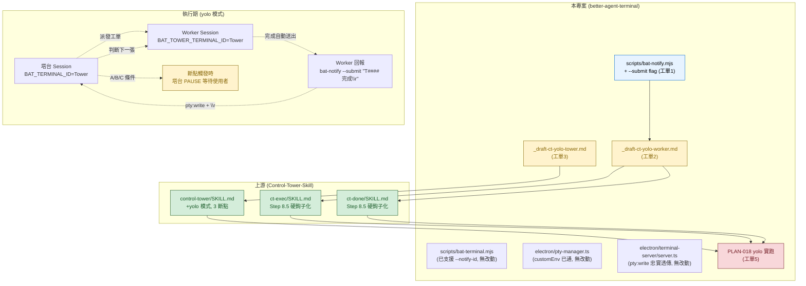

# PLAN-020 yolo Mode Feasibility Research (T0167)

> 產出時間：2026-04-18 12:30-13:10 (UTC+8)
> 研究者：T0167 Worker session（BAT_TERMINAL_ID=2853d9b6..., BAT_TOWER_TERMINAL_ID=c8a43b60...）
> Q1 決策：A（`bat-notify.mjs --submit` flag）— 使用者於 T0167 互動中確認
> Q2 決策：**保留**（需塔台參與討論）— 本報告 D 區採「條件式拆單」

---

## 總覽

### 核心根因結論（為何 `auto_session: on` 反向沒觸發）

**結論：機制上全部通了，Worker session 確實有 `BAT_TOWER_TERMINAL_ID`，但 Worker 收尾時的 bat-notify 呼叫是「可選 + 靜默」，實務上幾乎沒被真正執行**。

具體拆解：
1. ✅ **env 注入鏈路完整**：`pty-manager.ts:410/456/532` 透過 `customEnv` spread 把 `bat-terminal.mjs --notify-id` 傳入的 `BAT_TOWER_TERMINAL_ID` 正確注入到新 Worker PTY env
2. ✅ **T0167 本 session 實測可見** `BAT_TOWER_TERMINAL_ID=c8a43b60505544cf573367ebb45d7bcb`（即塔台的 `BAT_TERMINAL_ID`）
3. ❌ **`ct-exec` Step 8.5 被標記為「可選」+「靜默跳過」+「靜默降級」**，Worker AI 在收尾壓力下容易略過
4. ❌ **即使 bat-notify 成功執行，`pty:write` handler（terminal-server/server.ts:256）直接 `entry.pty.write(req.data)` 不附加 `\r`**，所以即便預填也只是「等使用者按 Enter」而非真正送出
5. ❌ **Step 8.5 沒有可觀察的成功反饋**（文件只寫「靜默執行」），使用者只看到 Step 11 剪貼簿提示，誤以為 Step 8.5 沒發生

工單原始描述「塔台 session 的 `BAT_TOWER_TERMINAL_ID` 未設定」是 **部分正確但誤解方向**：
- **塔台自己**的 `BAT_TOWER_TERMINAL_ID` 本來就該空（塔台沒有 parent tower）✅
- **Worker**的 `BAT_TOWER_TERMINAL_ID` 該有值——實測有 ✅
- 真正根因在 **skill 層語意**，不在 env 注入機制

### 技術前置難度總評

| 層級 | 難度 | 說明 |
|------|------|------|
| 🟢 BAT code | 低 | 只需在 `bat-notify.mjs` 加 `--submit` flag（~5 行改動） |
| 🟢 env 注入 | 零 | 現有鏈路已通，無需動 |
| 🟡 skill 層 | 中 | `ct-exec`/`ct-done`/`control-tower` 都要改，且須走上游協調 |
| 🟡 塔台自主決策邏輯 | 中 | Q2 來源未定，影響 C2 實作複雜度 |
| 🔴 斷點 A/B/C 實作 | 中高 | 需 skill 層定義「塔台如何辨識 Worker 回報訊息觸發自動下派 vs 普通輸入」 |

整體 **6-9h** 實作（與 PLAN-020 原估一致，不需擴大）。

---

## A. 現況根因分析

### A1. `bat-notify.mjs` 設計與呼叫點

**檔案**：`scripts/bat-notify.mjs:283-313`

**雙管道設計**（註解明確標示）：

| 管道 | 目的 | 送的 WebSocket message |
|------|------|----------------------|
| 管道 1 | UI 回饋 | `{ type: 'invoke', channel: 'terminal:notify', args: [{ targetId, message, source }] }` → Toast + Tab badge |
| 管道 2 | 文字預填 | `{ type: 'invoke', channel: 'pty:write', args: [target, message] }` → 寫入目標 PTY stdin |

**呼叫鏈**（實際碼路徑）：
```
ct-exec Step 8.5 (skill) 
  → bash: `node scripts/bat-notify.mjs "T#### 完成"` 
  → 解析 argv（line 56-100）
  → `MinimalWS.connect(127.0.0.1, BAT_REMOTE_PORT)` 
  → auth with BAT_REMOTE_TOKEN（line 268-281）
  → invoke `terminal:notify`（line 284-295）
  → invoke `pty:write`（line 299-312，僅當 ptyWrite=true）
```

**空白點**：整個 repo 中**只有 skill 文件**說「該呼叫」，**沒有任何 BAT code 自動呼叫** bat-notify.mjs：
```
Grep "bat-notify" in /scripts /electron /src → 只有 bat-notify.mjs 自身
Grep "bat-notify" in ~/.claude/skills → ct-done/SKILL.md:51, ct-exec/SKILL.md:275
```
→ 呼叫**完全依賴** Worker AI 是否執行 skill 的 Step 8.5。

### A2. `BAT_TOWER_TERMINAL_ID` 注入鏈路

**實際注入路徑**（驗證完整）：

```
塔台 session（PTY A，BAT_TERMINAL_ID=c8a43b...）
  ↓ 塔台派發工單，呼叫白名單指令
  ↓ bash: `node scripts/bat-terminal.mjs --notify-id $BAT_TERMINAL_ID claude "/ct-exec T####"`
  ↓ bat-terminal.mjs:67-76 解析 --notify-id → notifyId = "c8a43b..."
  ↓ bat-terminal.mjs:282-287 組裝：
      invokePayload.customEnv = { BAT_TOWER_TERMINAL_ID: notifyId }
  ↓ WebSocket invoke terminal:create-with-command
  ↓ main.ts:1558 registerHandler('terminal:create-with-command')
  ↓ pty-manager.ts:378 create(options)
  ↓ pty-manager.ts:410（server 模式）/ :456（node-pty）/ :532（child_process）
      envWithUtf8 = { ...process.env, ...customEnv, ...固定變數 }
      → customEnv.BAT_TOWER_TERMINAL_ID 保留（因為後續覆寫的 key 只有 BAT_TERMINAL_ID）
  ↓ 新 PTY 啟動，Worker session env 有 BAT_TOWER_TERMINAL_ID
```

**關鍵驗證**：T0167 本 session 實測：
```bash
$ echo "BAT_TOWER_TERMINAL_ID=$BAT_TOWER_TERMINAL_ID"
BAT_TOWER_TERMINAL_ID=c8a43b60505544cf573367ebb45d7bcb  # ← 塔台的 ID
```

**結論**：注入鏈路**完整且正確運作**，不需任何改動。

### A3. `pty:write` 不送 `\r` 的原因

**trace 路徑**：
- `bat-notify.mjs:304-306`：`args: [target, message]`，message 就是 CLI argv 拼接結果（`rawArgs.join(' ').trim()`）
- `terminal-server/server.ts:256`：`entry.pty.write(req.data)` ← 直接透傳

**設計意圖分析**（從命令列註解 `scripts/bat-notify.mjs:8` 明確說明）：
```
//   2. invoke `pty:write`       → Pre-fill text into target PTY stdin (without \r)
```
> "Pre-fill" 是**明確的設計決策**——讓塔台終端只「預填」，不自動送出。

**是安全設計嗎？** 非典型的「防注入」語意，但有實用層面的謹慎：
- 避免 Worker 誤觸發塔台執行危險指令
- 保留使用者「看一眼再 Enter」的審查機會
- 與 UI Toast（管道 1）配合形成「視覺通知 + 預填文字」的雙保險

**yolo 模式影響**：
- ✅ 原行為必須保留（`on` 模式仍是預填不送）
- ✅ 新增 `--submit` flag 時，必須**顯式**要求才送 `\r`
- ❌ 不能改 `pty:write` handler 自動加 `\r`——會破壞現有設計
- ✅ 正確作法：在 bat-notify.mjs 層把 `\r` append 到 message 字串，走同一個 `pty:write` channel

### A4. skill 層呼叫空白點

`ct-exec/SKILL.md:269-286`：
```markdown
### Step 8.5（可選）：BAT 自動通知 Tower

若偵測到 `BAT_TOWER_TERMINAL_ID` 環境變數（表示由 BAT 內的 Tower 派發）：

1. 執行通知：
   ```bash
   node scripts/bat-notify.mjs "T#### 完成"
   ```
2. 通知效果：
   - Tower 終端輸入行預填 `T#### 完成`（使用者按 Enter 送出）
   - BAT UI 顯示 Toast 通知 + Tab badge
3. 環境變數不存在時：靜默跳過（非 BAT 環境或非 Tower 派發）
4. 執行失敗時：靜默降級（log warning，不影響工單完成）
```

**空白點**（**這是主要根因**）：
1. **「（可選）」** — AI 解讀為「可以省略」，收尾壓力大時容易跳
2. **「靜默跳過」/「靜默降級」** — 沒有成功/失敗的回饋訊息，使用者看不到
3. **Step 11（剪貼簿）在 8.5 後仍執行** — 使用者看到「已複製『T#### 完成』到剪貼簿」以為已完成整個回報流程
4. **沒有強制「先執行 8.5 再執行 11」的檢查** — 兩步並列

`ct-done/SKILL.md:47-55` 有相同的語意與相同的問題。

**結論**：**skill 層設計是「軟鉤子」，yolo 模式需要升級為「硬鉤子」**（強制、有回饋、失敗阻斷收尾）。

---

## B. 技術前置方案（基於 Q1.A）

### B1. `bat-notify.mjs --submit` flag 設計

**改動面**：`scripts/bat-notify.mjs` 單檔，~5 行增量。

**實作草稿**（沿用既有 argv 解析風格）：
```javascript
// 在 line 88 的 --no-pty-write 解析後加入
let submitAfterWrite = false
const submitIdx = rawArgs.indexOf('--submit')
if (submitIdx !== -1) {
  submitAfterWrite = true
  rawArgs.splice(submitIdx, 1)
}
// ... message 組裝不變 ...

// 在 line 305 的 pty:write 呼叫改為
const payload = submitAfterWrite ? message + '\r' : message
ws.send(JSON.stringify({
  type: 'invoke',
  id: writeId,
  channel: 'pty:write',
  args: [target, payload],
}))
```

**語意**：
- 無 `--submit` flag（現狀）→ 送 `"T#### 完成"`（預填不送）
- 有 `--submit` flag（yolo）→ 送 `"T#### 完成\r"`（預填 + 自動 Enter）

**衝突性**：`--submit` 和 `--no-pty-write` 互斥（沒 PTY write 哪能 submit），應加檢查：
```javascript
if (submitAfterWrite && !ptyWrite) {
  console.error('Error: --submit requires PTY write (cannot combine with --no-pty-write)')
  process.exit(1)
}
```

**向下相容**：既有呼叫無 `--submit` → 行為完全不變 ✅

### B2. `BAT_TOWER_TERMINAL_ID` 注入機制

**結論：無需改動**（A2 已證實現有機制完整可用）。

唯一要注意：塔台呼叫 bat-terminal.mjs 時**必須**傳 `--notify-id $BAT_TERMINAL_ID`。目前 `control-tower/SKILL.md:40-41` 的白名單有寫此指令格式，但實際派發邏輯是否正確組裝 `--notify-id` 要在 skill 改動中確認。

### B3. `terminal-server` / `pty-manager` 改動

**結論：無需改動**。

Q1.A 方案把 `\r` 組裝留在 bat-notify.mjs 層，`pty:write` handler 繼續「忠實透傳」。若未來要支援其他 submit 機制（例如在畫面顯示「已自動送出」字樣），可再評估新增 `pty:submit` channel，但 yolo 一期不必要。

### B4. skill 層改動

**改動涵蓋三個 skill**（**皆為上游專案 Control-Tower-Skill**，本地用草稿檔規格化）：

| Skill | 改動內容 |
|-------|---------|
| `control-tower` | 新增 `auto-session: yolo` 第四態；tower config 面板顯示 ⚠️ YOLO ACTIVE；派發邏輯在 yolo 時白名單指令保持不變（仍是 `bat-terminal.mjs --notify-id`） |
| `ct-exec` | Step 8.5 升級為「必要」（非「可選」），新增：讀 `auto-session` config → `yolo` 時呼叫 `bat-notify.mjs --submit`，其他時呼叫無 `--submit`；失敗有 user-facing 訊息（非靜默） |
| `ct-done` | 同 `ct-exec` 邏輯（兩個 skill 的收尾路徑都要改） |

**新 config 值**：
```yaml
# _tower-config.yaml 或 ~/.claude/control-tower-data/config.yaml
auto-session: yolo  # 新增第四態，承繼 on 的所有行為 + submit 自動送 + 塔台自主決策

# 可選新增（見 C3）
yolo_max_retries: 3          # 斷點 B 的連續 FAILED 閾值
yolo_plan_source: research   # C2 來源（待 Q2 決策）
```

---

## C. 塔台自主決策邏輯設計

### C1. yolo 啟動識別

**來源**：`_tower-config.yaml` 的 `auto-session: yolo`（非新增 env 變數，減少 state 複雜度）。

**塔台啟動面板標示**：
```
╠═══════════════════════════════════════════════════════╣
║ ⚠️  YOLO MODE ACTIVE — 塔台將自主決策                     ║
║  斷點條件：A 非預期狀態 / B Renew≥3 或 3 FAILED / C 跨 PLAN  ║
║  關閉：*config auto-session on                         ║
╠═══════════════════════════════════════════════════════╣
```

**回報階段面板**（每張工單完成後塔台派下一張前）：
```
🤖 YOLO: T0xxx DONE → 自動派發下一張 T0xxy
   依據：<研究工單 T0xxx-R 的 D 區段 / PLAN-0xx 工單列表>
   斷點計數：Renew 0 / FAILED 0 / 3
   [Ctrl+C 中斷] [塔台手動介入請輸入：*pause]
```

### C2. 下一張工單判定規則

**依 Q2 決策**（本研究**不決策**，僅列條件式拆單）：

#### Q2 選項 A（研究工單 D 區段）
- 塔台派 yolo 前必先有一張研究工單（如 T0167 之於 PLAN-020）
- 研究工單回報區「D 拆單建議」**必須**為結構化 markdown 表格（有 ID + 依賴順序 + 完成判準）
- 塔台 parse 該表 → 當前工單 DONE → 找下一張未派發的（依順序）→ 派發
- **優點**：不引入新檔案格式，重用現有機制
- **缺點**：研究工單品質不一致可能導致 parse 失敗 → 觸發斷點 A

#### Q2 選項 B（PLAN 檔案）
- `PLAN-XXX.md` 必須有 `## 工單清單` 區段，結構化列出 `T####` + `status`
- 塔台讀 PLAN → filter pending → 依序派
- **優點**：PLAN 本來就追蹤多工單，符合語意
- **缺點**：需強制 PLAN 模板升級，並要有 tool 同步 PLAN ↔ 工單狀態

#### Q2 選項 C（專用 queue 檔案）
- `_ct-workorders/_yolo-queue.md` 每次開 yolo 前產生一次性 queue
- Worker 完成 → 塔台 pop queue 頂 → 派下一張
- **優點**：職責清楚，與既有工單機制解耦
- **缺點**：多一個檔案要維護，與 PLAN 資訊重複

### C3. 3 大斷點判準與機制

**斷點條件判準**（具體、可機械化判斷）：

| # | 條件 | 機械判斷 | 塔台動作 |
|---|------|---------|---------|
| A | Worker 回報非預期狀態 | Worker 收尾字串**不是** `T#### 完成` / `T#### 部分完成` / `T#### 需要協助` 四種預定義值之一 | 停下，顯示回報原文，問使用者 `[A/B/C]` |
| B (Renew) | 同一工單 Renew ≥3 | 讀工單元資料「Renew 次數」欄位 | 停下，提示「Renew 過多，建議拆新工單」 |
| B (FAILED) | 連續 3 張工單 FAILED | 塔台 session 級計數器（記在 `_tower-state.md`） | 停下，提示「連續失敗，yolo 自動暫停」 |
| C | 超出 PLAN 範圍 | Worker 在「建議方向」或「下一步」提到 **不在** 當前 PLAN 工單清單中的行動 | 停下，顯示 Worker 建議，問使用者 `[擴大 PLAN / 開新 PLAN / 忽略]` |

**觸發後機制**：
- 塔台面板顯示 `⏸ YOLO PAUSED — 斷點 X 觸發`
- Worker PTY 不自動再派，塔台**等待使用者輸入**（`continue` / `abort` / `*config auto-session on`）
- 塔台在 `_tower-state.md` 記錄斷點歷程（時間、工單、斷點代號）

**實作層面**：斷點 A 和 C 的判準本質是**字串比對 + Regex**，屬於 skill 層 AI 理解能勝任的任務，不需 BAT code 介入。

### C4. 視覺警示與日誌

- 啟動面板 ⚠️ 警語（見 C1）
- 每次 Worker 回報後，塔台顯示「YOLO: 自動派發」訊息，給使用者 1-2 秒視覺確認時間
- 斷點觸發時顯示 `⏸ YOLO PAUSED` + 原因
- `_tower-state.md` 新增 `## YOLO 歷程` 區段，時序記錄每次 yolo 執行 + 斷點

---

## D. 4 張實作工單拆單建議（條件式）

### 專案歸屬規則（先確認邊界）

| 改動類別 | 專案 | 工單前綴 |
|---------|------|---------|
| `scripts/bat-notify.mjs` / `scripts/bat-terminal.mjs` | 本專案 (better-agent-terminal) | `T####` |
| `electron/` 任何檔案 | 本專案 | `T####` |
| `~/.claude/skills/` 底下的 control-tower / ct-exec / ct-done | **不可直接寫**（Layer 1 唯讀）→ 本專案先出草稿 + 後續 COORDINATED 推上游 | 本專案草稿：`T####`（產 `_draft-ct-yolo-*.md`）<br>上游：`CT-T###`（COORDINATED，`project-prefix: CT`） |
| 驗證（跑 PLAN-018） | 本專案 | `T####` |

### 拆單總表

| 工單 | 標題 | 專案 | 依賴 | 工時 | 風險 |
|------|------|------|------|------|------|
| **工單 1** | BAT code：`bat-notify.mjs --submit` flag | 本專案 `T####` | — | 1-1.5h | 🟢 |
| **工單 2** | 本地草稿：Worker skill 自動回報規格 | 本專案 `T####` | 工單 1 | 1-1.5h | 🟢 |
| **工單 3** | 本地草稿：塔台 skill 自主決策 + 3 斷點規格 | 本專案 `T####` | 工單 2 | 2-3h | 🟡（含 Q2 條件分支） |
| **工單 4** | 上游 COORDINATED：skill 三件套推 Control-Tower-Skill | 上游 `CT-T###` | 工單 2 + 3（草稿完成） | 2-3h | 🟡 |
| **工單 5** | 本專案驗收：PLAN-018 剩 4 張工單 yolo 實跑 | 本專案 `T####` | 工單 4（上游 skill merge 回本機） | 1-2h | 🟢 |

> 原 PLAN-020 預估 4 張，實際拆成 5 張較清楚（多出「本地草稿」與「上游 COORDINATED」的職責分離）。

---

### 工單 1：BAT code — `bat-notify.mjs --submit` flag

**專案**：本專案 `T####`
**依賴**：無
**風險**：🟢

**核心變更**：
- 修改：`scripts/bat-notify.mjs`
  - argv 解析新增 `--submit` flag（line 88 附近風格）
  - line 305 `args: [target, message]` 改為依 flag 決定是否 append `\r`
  - 加 `--submit` + `--no-pty-write` 互斥檢查
- 修改：`package.json` 未變（flag 在 script 內，無 build 影響）
- 無 TypeScript / electron 側改動

**驗收條件**：
- ✅ 無 flag 呼叫行為與現狀一致（回歸驗證）
- ✅ `--submit` 使目標 PTY 收到 `\r`（可用兩個 BAT 終端 A/B 互測：A 跑 `node scripts/bat-notify.mjs --submit --target <B-id> "echo ok"`，B 終端出現 `echo ok` 並自動執行，列印 `ok`）
- ✅ `--submit --no-pty-write` 回傳 exit code 1 + 錯誤訊息
- ✅ `--submit` 下仍執行 `terminal:notify`（Toast 仍顯示）

**預估**：1-1.5h（含驗證）

---

### 工單 2：本地草稿 — Worker skill 自動回報規格

**專案**：本專案 `T####`
**依賴**：工單 1
**風險**：🟢

**核心變更**：
- 新增：`_ct-workorders/_draft-ct-yolo-worker-skill-patch.md`
  - 規格化 ct-exec SKILL.md Step 8.5 和 ct-done SKILL.md 的等效段落改動
  - 新 step 順序：**Step 8.5 升級為必要**（非可選）；Step 11（剪貼簿）作為 fallback（當 bat-notify 失敗時才跑）
  - 新決策：讀 `auto-session` config → `on` → `bat-notify.mjs "T#### ..."`（無 --submit）；`yolo` → `bat-notify.mjs --submit "T#### ..."`
  - 新回饋：執行成功顯示 `📡 已通知塔台（YOLO 模式自動送出）` 或 `📡 已預填塔台終端（請切回塔台按 Enter 送出）`
  - 失敗訊息：`⚠️ bat-notify 執行失敗：<reason>，降級到剪貼簿`

**驗收條件**：
- ✅ 草稿檔符合 Control-Tower-Skill 上游的 PR 規格格式（參考 PLAN-011 先例）
- ✅ 草稿涵蓋 ct-exec 和 ct-done 兩個 skill 的同構改動
- ✅ 草稿明確標示「硬鉤子語意」：`auto-session=on` 下失敗會 log warning 但不阻斷；`auto-session=yolo` 下失敗則**阻斷工單完成**（避免 yolo 陷入無回報的靜默狀態）

**預估**：1-1.5h

---

### 工單 3：本地草稿 — 塔台 skill 自主決策 + 3 斷點規格

**專案**：本專案 `T####`
**依賴**：工單 2（Worker 回報語意要先固定）
**風險**：🟡（含 Q2 條件分支）

**核心變更**：
- 新增：`_ct-workorders/_draft-ct-yolo-tower-skill-patch.md`
  - C1: `auto-session` 四階擴充（yolo + 啟動面板 ⚠️ 警語）
  - C2: **三份平行章節**（對應 Q2.A / Q2.B / Q2.C），塔台 merge 前由塔台決策選一份
  - C3: 3 斷點條件的完整判準（字串比對規則、計數器位置、觸發後互動腳本）
  - C4: 視覺警示 + `_tower-state.md` 的「YOLO 歷程」區段格式
  - 新 config 規格：`yolo_max_retries`、`yolo_plan_source`（Q2 決策後才啟用）

**驗收條件**：
- ✅ C2 三個分支都有完整可實作規格（不是占位 TODO）
- ✅ 3 斷點判準可用 regex / 字串比對實現（不依賴 AI 主觀判斷）
- ✅ 包含回歸測試場景（yolo off/on/yolo 三種路徑的驗證劇本）

**預估**：2-3h

---

### 工單 4：上游 COORDINATED — skill 三件套推 Control-Tower-Skill

**專案**：上游 `CT-T###`（需啟用 `project-prefix: CT`）
**依賴**：工單 2 + 工單 3（兩份草稿都完成，且塔台已決策 Q2 選哪個分支）
**風險**：🟡

**核心變更**：
- **需使用者決策 Q2** 後，該分支的規格固定
- 產出 COORDINATED 工單到 Control-Tower-Skill 專案，`affected-projects` 列：
  - `control-tower` SKILL.md 升級（C1+C2+C3+C4）
  - `ct-exec` SKILL.md 升級（Step 8.5 硬鉤子化）
  - `ct-done` SKILL.md 升級（同 ct-exec）
- 本地需同時更新 `_ct-workorders/_cross-references.md`

**驗收條件**：
- ✅ 上游 3 個 skill 檔案都有 commit
- ✅ 上游 merge + 發佈新 skill 版本
- ✅ 本機拉新 skill → `*rescan` 後塔台面板顯示 YOLO mode 可用
- ✅ `auto-session: yolo` 實際啟用時無 error

**預估**：2-3h（含上游等待時間，可能跨 session）

---

### 工單 5：本專案驗收 — PLAN-018 剩 4 張工單 yolo 實跑

**專案**：本專案 `T####`
**依賴**：工單 4（上游 skill 回流本機）
**風險**：🟢

**核心變更**：無 code 改動，純驗證。

**驗收條件**：
- ✅ 解凍 PLAN-018，確認剩下 4 張工單可按依賴順序列出
- ✅ `*config auto-session yolo` 啟用
- ✅ 使用者啟動 4 張工單序列（首張用 `*dispatch T####`），後續 **全自動** 跑到完成
- ✅ 過程中斷點 A/B/C **至少其中一個** 實際被觸發（以驗證斷點機制運作，若未觸發則需手動造測試場景）
- ✅ 過程無手動介入（除斷點觸發後的使用者決策外）
- ✅ 完成後產出「yolo 首次實戰報告」供未來 PLAN 參考

**預估**：1-2h（觀察 + 報告撰寫）

---

## E. 技術路徑圖



**閱讀指引**：
- 🔵 藍色：本專案 BAT code 改動
- 🟡 黃色：本專案草稿檔（規格化）
- 🟢 綠色：上游 skill 改動（COORDINATED 工單）
- 🔴 紅色：實跑驗收

---

## F. 待塔台決策的 Q2（關鍵）

**Q2：塔台自主派下一張工單的資訊來源？**

- `[A]` **研究工單 D 區段**：重用現有機制，工單 3 規格寫 A 分支
- `[B]` **PLAN 檔案結構化工單清單**：PLAN 模板升級，工單 3 規格寫 B 分支
- `[C]` **專用 queue 檔案**（`_yolo-queue.md`）：引入新檔案，工單 3 規格寫 C 分支

**影響範圍**：
- 決策前：工單 3 規格保持「三分支平行」狀態，工單 4（上游 COORDINATED）**無法啟動**（需知道要推哪個 C2 版本）
- 決策後：工單 3 收斂為單一分支 + 工單 4 可立即派發

**研究者觀察**（僅供塔台參考，不做推薦）：
- A 最輕量，但依賴每次 yolo 前都有品質夠好的研究工單
- B 語意最符合（PLAN 本來就多工單），但模板升級成本高
- C 最獨立乾淨，但多一個檔案要維護，跟 PLAN/工單資訊重疊

---

## 下一步選項

- `[A]` **接受條件式拆單（推薦）**
  - 派發工單 1（BAT code 可立刻開工，無 Q2 依賴）
  - 塔台內部討論 Q2 → 決策後工單 2/3 的 C2 分支固定
  - 工單 4 上游協調在 Q2 固定後啟動
  - 工單 5 驗收在工單 4 完成後

- `[B]` **調整拆單**（合併或拆細）
  - 例如把工單 2+3 合併成一張「yolo skill 規格雙草稿」（若使用者覺得兩張過細）
  - 或把工單 1 再拆成「argv 解析」+「\r append」兩張（若使用者要極細粒度）

- `[C]` **調整 PLAN-020 範圍**（skip 某能力）
  - 例如只做 A 能力（Worker 自動送出）先上線，B 能力（塔台自主）延到後續 PLAN
  - 或只做 on 模式升級（把 Step 8.5 變硬鉤子但不送 `\r`），不進 yolo

**研究者推薦：[A]**，理由：
1. 工單 1 無 Q2 依賴，可立刻並行
2. 條件式拆單讓塔台有時間討論 Q2，不阻塞 BAT code 工作
3. 符合 PLAN-011 先例（本專案草稿 → 上游 COORDINATED）
4. 斷點機制與 Q2 選項**正交**，不因 Q2 決策延遲而重做
